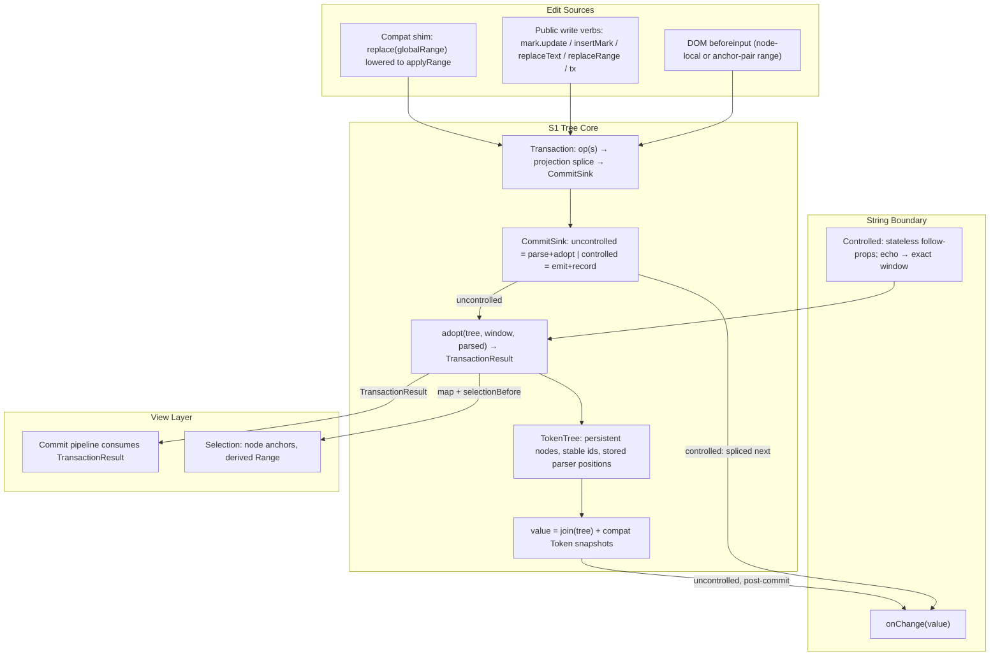

# S1 Tree Core — Subsystem Design Spec

**Version:** 2.2
**Status:** Reviewed (2026-08-08); amended 2026-08-09
**Date:** 2026-08-08
**Parent Spec:** none — self-contained; supersedes v1
(`2026-08-08-markput-s1-tree-core-v1.md`) after the 15-agent multi-lens review
(`docs/superpowers/reviews/2026-08-08-tree-core-spec-review.md`).

**v2 → v2.1 (verification-driven):** a 6-agent adversarial verification of v2
found the architecture sound but the document not implementable without
guessing. v2.1 amends: `applyRange` as the base op (cross-node/whole-value
edits were inexpressible), a defined `NodeAnchor` model and API host object,
window-bound conditions in the adoption walks (a
proven counterexample broke AC-3.1 on repeated content), the restored
output-equivalence property (the v2 "tautology" claim was false), refused-descend
child identity, the `render` routing bit and pending-window read semantics in
the view contract, pre-adoption selection capture, `lastEmitted` validity
conditions, honest G2/G5 claims and mechanism ledger, transition mechanics
for pre-cutover phases, and the S1.6 big-bang split. Two verification
amendments were subsequently **descoped by maintainer decision**: the
composition/IME latch (behavior stays as today; sketch preserved in §9) and
the readonly-view layer (one node structure, D11).

**What changed from v1 (review-driven):**

- The public API is the spec's center of gravity (§2.3); the old surface is
demoted to a compat layer with a sunset. v1 froze the old API (G6/D8).
- The windowed re-tokenizer (v1 D4/S1.3) is cut — O(document) guard, coverage
collapse on ordinary text, served a demoted goal. Edit path = synchronous
full parse + deterministic op-anchored adoption.
- One identity mechanism: the same `adopt` serves the edit path (exact op
window) and the boundary reset (gap-derived window); `tokenIdentity` is
deleted at cutover.
- Prefix-sum derived positions (v1 D3) cut; nodes store parser-stamped
positions refreshed by adoption.
- Inverse-op recording cut; undo flagged as real near-term work (§9).
- `TransactionResult` view contract; `TreeNode` sole owner of content.
- Stateless controlled protocol with a specified interleaving matrix;
selection lands with cutover.

---

## 1. Overview

Markput's core treats the **string** as the source of truth: every edit
produces a new string, the whole string is re-parsed, and a diff/identity
layer (`tokenIdentity` + the consume-once edit hint in `ValueModel`)
reconstructs *which tokens changed* — knowledge the edit site had and threw
away. The public API mirrors the string model: the only general write verb is
`replace(globalRange, string)`, reads are positional `Token[]` snapshots that
go stale on every edit, and selection is a global number pair.

This spec inverts the architecture and surfaces the inversion as the product.
The **token tree** of persistent, identity-stable nodes becomes the source of
truth; the string becomes a computed projection (`join(tree)`) for the
`props.value`/`onChange` boundary. Edits flow as transactions whose edit
window travels **synchronously as a function argument** on the internal edit
path — no stored hint, no async reconstruction. The public API exposes what
the tree makes natural: live nodes with stable ids, model-centric write
verbs, node-anchored selection.

Performance is explicitly not a driver. The edit path does a full parse of
the projection per transaction — microseconds at input-field sizes by the
project's own benchmarks, exactly what ships today — followed by a
deterministic adoption that preserves node identity outside the edit window
by construction.

### 1.1 Goals

- **G1. Best public API.** Node-based reads (ids always present, no stored
absolute positions in public shapes), model-centric write verbs, node-anchored
selection, and a change event with a payload — as the primary public surface
(§2.3). The old offset/snapshot surface is deleted outright, not moved behind
a compat entry — see the amended D8.
- **G2. Kill the reconstruction layer on the internal edit path.** No stored
edit hint, no `takePendingEdit`, no heuristic per-edit diff: the window is a
synchronous argument from edit site to adoption. At the *controlled
boundary*, where an async gap is inherent, exactly one named, value-guarded
record remains: `lastEmitted` (D6) — with a specified degradation
contract, unlike today's silently-stale hint.
- **G3. Identity by construction outside the edit window.** Nodes persist;
adoption is deterministic given (previous tree, window, parse result), and
identity outside the window is property-gated. Inside the window,
same-index pairing is best-effort continuity (as today — see §4.2 step 3).
One adoption mechanism serves the edit path and the boundary reset.
- **G4. Node-anchored selection.** `{node, offset}` is the stored form; the
global numeric range is derived. Caret survives edits via the transaction's
position mapping.
- **G5. Fewer mechanisms, honestly counted.** At cutover the system deletes
six mechanisms and adds five (§4.6 checklist) while temporarily carrying the
compat facade; with D8 amended no compat facade is built, so the count is net
negative at S1.8 rather than at an unscheduled major.
Source line count grows at cutover (new core + compat coexist) and shrinks
after compat removal; the deleted `tokenIdentity` spec suite (~1160 lines)
is replaced by smaller property suites. The §4.6 checklist — not a vague
line balance — is the S1.6d review gate.

### 1.2 Non-Goals

- Raw performance. Full parse per keystroke is the accepted cost model
(µs-scale; `parser.bench.ts` tripwire). A windowed re-tokenizer remains a
benchmark-gated future drop-in behind the adoption seam (§9).
- Undo/redo implementation — but see §9: native undo is already dead (the
input path preventDefaults text input), so undo is real near-term work to
be designed on transactions. No speculative inverse-op recording.
- Collaborative editing / OT / CRDT.
- First-class block rows — block mode keeps whole-value semantics through the
internal offset shim (lifetime per D8); rows-as-tree-scopes is the natural
follow-up (§9). Block mode keeps `filterEmptyText`; between-row addressing
uses `NodeAnchor` before/after forms (§2.3).
- **Composition/IME handling** (maintainer decision: too much machinery for
now). Behavior at cutover matches today's: composition input types are
unhandled beyond browser defaults, and a mid-composition commit sweeps the
composing surface exactly as the current pipeline does — the rewrite makes
this neither better nor worse. The sketched design (commit latch, deferred
arrival, compositionend absorption) is preserved in §9 for when it is
picked up.
- Parser algorithm changes.

## 2. Architecture

### 2.1 Component Diagram




### 2.2 Key Design Decisions

**D1 — Tree is the source of truth; the string is a projection.**
`value` is `Computed<string>` = concatenation of node contents, read at the
`props.value`/`onChange` boundary and by the offset shim.
*Tradeoff:* controlled mode needs echo detection (D6); serialization must be
exact (`annotate`/`toString` round-trip is the pinned contract).

**D2 — One identity mechanism: deterministic adoption.**
`adopt(tree, window, parsed)` pairs the previous node tree with a fresh parse
of the new projection, guided by an edit **window**. Two window sources, one
algorithm:

- *Edit path:* the transaction's exact op window — a synchronous argument.
- *Boundary reset:* a gap-derived window (`gapWindow` — the ~18-line
`hintFromValues` policy, ported).
`tokenIdentity.ts` and its spec suite are **deleted at cutover** — adoption
replaces both its roles; key fixtures are ported to adoption specs.
*Design note:* adoption deliberately mirrors reconcile's proven pairing
structure — including its window-bound walk conditions (§4.2), which are
load-bearing, not decorative — reimplemented over persistent nodes with a
different output contract (`TransactionResult`, D9). It is not a retargeting
of the reconcile code: reconcile's output shape exists to feed the old
pipeline and dies with it.

**D3 — Positions are parser-stamped, stored, non-reactive.**
Nodes carry `position {start, end}` as plain mutable fields written only by
adoption: retained prefix nodes keep theirs, suffix nodes get a delta shift
(field writes — render-inert), changed regions get fresh parser positions.
No prefix-sum subsystem. `node.range()` reads the stored positions.
*Tradeoff:* suffix nodes get field writes on every edit — accepted; plain
writes on data no renderer observes reactively.

**D4 — Edit path: synchronous full parse + adoption.**
A transaction lowers its op(s) to a projection splice: `next` string + exact
window. The uncontrolled CommitSink then runs `parser.parse(next)` — the
parser is the single semantic authority — and `adopt(tree, window, parsed)`
in one signal batch.
The *parse* being authoritative is true by construction; the *adoption of the
parse into the persistent tree* is the non-tautological part, and §7.1 gates
it directly: after every adopt, `snapshot(tree)` deep-equals `parsed`
(positions included), alongside the identity property.
The fast path is an adoption outcome, not a separate mechanism: an interior
text edit that keeps token structure retains every node and performs exactly
one content-signal write (AC-1.1/1.2).
*Why not the v1 window ladder:* O(document) guard, coverage collapse on
ordinary segment characters in prose, ~350 riskiest-tier lines buying only
parse time — a demoted goal.

**D5 — All mutations are transactions over one primitive; CommitSink splits
commit policy from dispatch.**
The base op is `**applyRange(window, text)**` — a global-window splice (the
window is what `adopt` consumes anyway). Everything lowers to it:

- `applyText(node, localRange, text)` — convenience: node's stored range +
local range → window. Single-node edits.
- `applyStructural(target, replacement)` — serialize via `annotate`, window =
target's stored range. Mark update/remove, insertMark.
- Cross-node edits (selection spanning text–mark–text: overtype, delete,
cut), whole-value set/clear, block row ops, and the overlay trigger
replacement (a sub-node span) are `applyRange` directly. The compat shim
lowers `replace(globalRange)` to it.
A transaction is atomic (one signal batch), gates `readOnly` at entry before
any mutation or emission, and throws on re-entrant dispatch (mirroring the
commit pipeline's existing guard). `tx(fn)` collects verb calls into a
working splice buffer applied sequentially (each subsequent verb's targets
resolve through accumulated offset remapping; overlapping ops reject the
whole tx) → one `next`, adoption window = hull of the op windows (identity
precision inside the hull degrades to middle-pairing — accepted and
documented) → one commit → one emission.
Transactions produce `{next, window}` and hand off to a **CommitSink**:
S1.3's uncontrolled sink (parse + adopt + commit), S1.4's controlled sink
(emit + record) — the controlled branch never patches transaction internals.

**D6 — Controlled mode: stateless, model follows props.**

- *Uncontrolled:* commit synchronously; `onChange(projection)` post-commit.
- *Controlled:* the transaction does **not** commit (no tree mutation). It
computes `next` by string-splicing the committed projection, fires
`onChange(next)`, and records `lastEmitted = {base, value: next, window}`
where `base` is the projection it spliced. On **every** `props.value`
arrival, `lastEmitted` is taken and cleared (matched or not); the arrival
adopts with the exact recorded window **iff** `arrival === lastEmitted.value && committedProjection === lastEmitted.base`, else with a gap-derived
window. One path either way; adoption is always continuity-preserving —
there is no destructive fork.
- *Verb contracts in controlled mode:* boolean verbs return `true` when the
edit was accepted and **emitted** (matching today's `replace()` contract),
independent of commit. `insertMark` returns `undefined` in controlled mode
(the node exists only after the echo commits); callers needing the node
re-find it post-echo via `changed`/`find`. No optimistic caret move: the
caret is repaired once, at echo adoption, via `map` — a deliberate,
improving deviation from today's clamp-drift on non-echoing parents.
Selection intent for the pending emission is carried in `lastEmitted`'s
window and applied by the echo adoption's map (§7.2 matrix rows: caret
correct after echo, after stale echo, after transform).
- *Interleaving matrix (tested §7.2):* edit→echo (exact window, AC-4.1);
edit→edit→echo — second edit recomputes from the committed projection,
`lastEmitted` overwritten; a stale first echo mismatches `value` → gap
adoption; a subsequent echo of the second emission fails the `base` check
(the tree moved) → gap adoption. AC-4.1's exact-window promise is scoped to
single-echo-per-emission. An async parent that applies both emissions in
order ends at the second value with the first edit's content absent — this
is today's behavior and inherent to stateless controlled inputs; AC-4.3
therefore guarantees *no stale-echo clobber and no destructive reset*, not
parent-side race outcomes.
- Transforming parent → gap adoption every time (today's fallback, never
worse). Rejecting parent → nothing happens; no caret drift (see above).
Re-entrant `onChange` → synchronous `props.value` set: same arrival path.
`defaultValue`, parser change, `isBlock` change: boundary arrivals with
gap-derived (or degenerate full) windows.

**D7 — Selection anchors to nodes; capture precedes adoption.**
Stored: `{anchor: NodeAnchor, head: NodeAnchor} | undefined`, right affinity
canonical (the DOM layer's `boundaryFor` affinity parameter exists today).
Derived: global `Range` from stored positions.
**Capture ordering (normative):** the dispatcher snapshots the selection's
numeric range at transaction/boundary entry, **before** `adopt` runs
(adoption mutates stored positions in place — post-hoc derivation would
double-shift), and threads it into the result as
`TransactionResult.selectionBefore`. `map(offset)` is defined **only for
pre-adoption offsets**. Order: entry → capture → adopt → commit → repair
(SelectionController consumes `selectionBefore` + `map`). The same rule
covers boundary resets — numeric survival across resets is kept without
ValueModel owning selection: the capture hook is Store-level wiring (S1.6a).

**D8 — No public compat artifact; the internal shim keeps its own lifetime.**
*Amended 2026-08-09 after a 31-agent obsolescence inventory.* The original
decision built `@markput/core/compat` + adapter mirrors, frozen at cutover
and "removed next major". Three measured facts killed it:
1. **`@markput/core` is not published** — `npm view @markput/core version`
   → 404, while `@markput/react` and `@markput/vue` ship at 0.14.3. So
   `@markput/core/compat` is unreachable by users; only adapter mirrors
   would be public at all.
2. **Those mirrors are new build machinery in two packages** — each adapter
   has ONE vite lib entry, ONE rolldown DTS bundle (`codeSplitting: false`)
   and a CSS `intro` hook keyed on `chunk.fileName === 'index.js'`; core's
   `exports` map has two entries and no subpath support.
3. **"Next major" has no date** — the repo is 0.x with
   `bump-minor-pre-major: true`, so the sunset would be indefinite.
Building it for an audience that cannot reach it and deleting it one phase
later is pure cost. **The public compat artifact is NOT built.** S1.7
executes the export-disposition table directly. Verified per symbol: the
shapes it would have carried (`EditController.replace`, `TextToken`,
payloadless `changed`) have zero consumers outside `packages/core`.
*Internal offset shim* (global range → `applyRange`) — unchanged: an
internal mechanism consumed by block mode, its removal gated on the §9
block-rows work. Seven live whole-value sites (`BlockController.ts:35`,
`blockEdit.ts:84,132,278`, `input.ts:37,60,129`) and no `setValue` verb in
`tree/transactions.ts`; rewriting `block/operations.ts` to precise windows
is a caret-semantics change with pinned behavior, not a cleanup.
*Migration net:* during the cutover the existing suites run against the
UNCHANGED core surface (nothing is moved behind a subpath), and §5
classifies which spec files are behavioral vs deleted-internal. The final
sweep is **S1.8**.

**D9 — `TransactionResult` is the single change feed; one owner per datum.**

```
TransactionResult {
  structural: boolean            // any node add/remove/move
  render:     boolean            // structural OR updated contains a MarkNode —
                                 // the compat snapshot renderer routes on this
                                 // (mark props are snapshot-driven until S1.7;
                                 // vestigial once node-signal mark props land)
  added:    {node, path}[]       // fresh nodes, tree order
  removed:  Id[]                 // subtree-inclusive
  updated:  TreeNode[]           // content/value/meta signal written
  shifted:  TreeNode[]           // position-only field writes (render-inert)
  selectionBefore: Range | undefined   // captured pre-adoption (D7)
  map(offset: number): NodeAnchor      // valid for pre-adoption offsets only
}
```

Ownership: `TreeNode` owns token content; `TokenHandle` becomes an id-keyed
DOM-binding view over a node (its `#token` snapshot and `update()` are
deleted — in S1.6d, not S1.5); the pipeline holds no `latest` token array.
**Pending-window reads:** `#token`'s second role today is DOM-generation
consistency (between a structural apply and its bind, reads are stale
*consistently with the still-painted DOM*). v2.1 keeps that property:
handles cache **bind-generation positions** (stamped at bind, refreshed with
the DOM), and DOM-boundary reads (`handleAt`/`boundaryFor`/selection sync)
resolve against them, not against adoption-fresh `node.range()`. The "latch
regime dies" claim is scoped to the **write path** (writes always go through
transactions on live nodes); the read latch during the adopt→bind window
survives, now with a stated rationale. S1.5 verification includes a
mid-window boundary-read case.
**Compat snapshot semantics:** snapshot mapping is memoized per node and
reuses unchanged snapshot objects (invalidated from the `TransactionResult`
delta, applied synchronously at adoption — `tokens.current()` stays fresh and
consistent with `value.current()` per §4.4); the renderTree reference changes
iff `render` is set; `TransactionResult`s accumulated between paints (the
fold) merge `added`/`removed`/`updated` and compose `map()` for the single
deferred `changed`.

**D10 — Composition/IME: descoped (maintainer decision).**
No composition handling ships in this rewrite; behavior stays exactly as
today (see §1.2). The `isAllSelected` beforeinput branch rewrite in S1.6a is
still in scope on its own merits (it is part of the input rewiring), but no
latch, no deferral, and no compositionend absorption are built. The future
policy sketch lives in §9.

**D11 — One node structure; per-node reactivity exists for the public API.**
`TreeNode` is simply the union `TextNode | MarkNode` — there is **no
separate public wrapper** (maintainer decision: one structure, no
readonly-view layer). The same node objects flow through adoption and out of
`input.nodes()`; their signal fields double as the public reactive read
(`node.text()` subscribes). The mutation contract is by convention, not
construction: adoption is the only supported writer; calling a node signal
as a setter from userland is unsupported and breaks the round-trip
invariant — documented, not runtime-policed. (Optional, zero runtime cost:
the exported types may declare signal fields as `() => T`; S1.7 review
decides.) This consciously reverses the recorded "no per-node reactivity"
trade on today's `TokenHandle` — the economics changed: API v2 is the
subscriber that trade lacked.

### 2.3 Target Public API (v2 surface)

The chapter v1 lacked. Semantics are binding; naming may be polished at S1.7
review.

**Host object.** The API hangs off `MarkputApi` — the evolved
`MarkputHandler` (it absorbs `focus()`; `input` below is a `MarkputApi`
instance). Acquisition: core — `store.api`; React — `useMarkput(s => s.api)`
or the component ref; Vue — the component ref / provide-inject equivalent.

**Glossary.** `Id` = number, assigned at node birth, never reused within an
input instance. `NodeAnchor` — see below.

**NodeAnchor — the addressing model:**

```ts
type NodeAnchor =
  | {node: TextNode; offset: number}       // 0..text.length, char offset
  | {before: TreeNode} | {after: TreeNode} // boundary forms
  | 'start' | 'end'                        // document edges (valid on empty tree)
```

`{node: MarkNode; offset}` is NOT a legal anchor — mark interiors are
addressed via their slot's child text nodes; mark boundaries via
`before`/`after`. Block mode keeps `filterEmptyText`, so between-row
positions have no `TextNode`; `{after: rowNode}` addresses them — the splice
materializes the interstitial text and the parse of the spliced projection
recreates canonical structure. Anchors resolve to a global offset at
transaction entry (via stored positions); `'caret'` in verbs means the
current selection head and yields `undefined`/`false` when there is none.

**Value (unchanged — markput's differentiator):**

```ts
props: { value?: string; defaultValue?: string; onChange?: (value: string) => void }
input.value(): string
```

**Reads — live nodes (one structure, D11):**

```ts
input.nodes(): readonly TreeNode[]         // reactive
TextNode:  { id: Id; text(): string }
MarkNode:  { id: Id; markup: Markup; value(): string; meta(): string | undefined;
             slot(): string | undefined; children(): readonly TreeNode[];
             update(patch: {value?, meta?, slot?}): boolean; remove(): boolean }
node.range(): {start: number; end: number} // explicit derived read
input.find(id: Id): TreeNode | undefined
```

Ids always present — the `id?` optionality and its throw-paths (`keyOf`,
`fromToken`) do not exist in v2 shapes. Write verbs on `MarkNode` ride
transactions (D5); `useMark()` returns this same `MarkNode`.

**Writes — model-centric verbs over D5's primitive:**

```ts
mark.update({value?, meta?, slot?}): boolean
mark.remove(): boolean
input.insertMark(at: NodeAnchor | 'caret', init: {markup, value, meta?, slot?}): MarkNode | undefined
input.replaceText(target: {node: TextNode; start: number; end: number}, text: string): boolean
input.replaceRange(from: NodeAnchor, to: NodeAnchor, text: string): boolean  // cross-node
input.setValue(text: string): boolean      // whole-value; input.clear() = setValue('')
input.tx(fn: () => void): boolean          // D5 composition rules
input.focus(): void
```

`replaceText`/`replaceRange` replacements are raw splices — markup in the
text takes effect (that is how overlay commit works). Controlled-mode return
contracts per D6 (accepted+emitted; `insertMark` → `undefined` pre-echo).

**Selection:**

```ts
input.selection(): {anchor: NodeAnchor; head: NodeAnchor} | undefined   // reactive
input.select(anchor: NodeAnchor, head?: NodeAnchor): boolean
input.caret(at: NodeAnchor): boolean
input.selectionRange(): {start: number; end: number} | undefined
```

**Events:**

```ts
onChange(value: string)
input.changed: Event<{added: Id[]; removed: Id[]; updated: Id[]}>
```

Replaces the wave-scoped `removedIds()` side channel; `BlockController`
migrates to the payload (S1.5 scope).

**Adapters:** `useMarkput(store => …)` stays the adapter access surface as
today — maintainer's decision: it is NOT replaced by narrow hooks. The
accepted consequence: internal `Store` reshuffles during S1.4–S1.7 are
visible to userland selectors (breaking changes are in scope). `useMark()`
returns the node-backed `MarkNode` view (no captured-token fallback).

**Export disposition (every current `@markput/core` root export):**


| Export                                               | Disposition                                                                                          |
| ---------------------------------------------------- | ---------------------------------------------------------------------------------------------------- |
*Corrected 2026-08-09 by the obsolescence inventory — the original table was
written from a partial reading and four rows were wrong. Corrections marked
**[fix]**; "compat entry" rows are gone with D8's amendment.*

| Export                                               | Disposition                                                                                          |
| ---------------------------------------------------- | ---------------------------------------------------------------------------------------------------- |
| `Store`                                              | keep — the ONLY resolution path for both adapters, which import it as a value and construct it (react `MarkedInput.tsx:2,84`; vue `MarkedInput.vue:2,16`). Neither re-exports it by name; that is not the same as unused. |
| `MarkputHandler`                                     | replaced by `MarkputApi` (absorbs `focus()`); its `overlay` getter is consumer-free and goes with it  |
| `EditController.replace`                             | **[fix]** deleted from the root, NOT moved to compat — 13 call sites, all inside `packages/core`, zero in any adapter/storybook/website. The class survives internally (its `caretAt` + `batch()` pairing has no v2 equivalent). |
| `Token`/`TextToken`/`MarkToken` types                | **[fix]** names leave the four barrels; the INTERFACES stay in `parser/types.ts` — `tree/adopt.ts` and `tree/snapshot.ts` consume them permanently and parser changes are a §1.2 non-goal |
| `TokenPath`, path utils                              | deleted (D9 paths are internal) — but see S1.6d's added scope: three production readers of `TokenHandle.path()` must retire with the writer |
| `MarkupDescriptor`                                   | not exported; `MarkNode.markup` is the public view                                                   |
| `signal`/`computed`/`watch`/`batch`                  | not exported from root (internal); `event`/`isReactive`/`Signal`/`Event` go with them                |
| `annotate`/`denote`                                  | keep (string-domain utilities)                                                                       |
| `toString`                                           | **[fix]** row struck — it is NOT a root export today (only `annotate`/`denote` are). Honouring the old "keep" row would ADD surface with no caller. |
| `key` (key generator)                                | keep (adapter rendering utility)                                                                     |
| `cx`                                                 | keep (adapter utility); **[fix]** `merge` drops — zero importers outside `packages/core`             |
| `filterSuggestions`/`navigateSuggestions`            | keep (overlay UX helpers)                                                                            |
| `readSelected`/`Selectable`                          | **[fix]** KEEP at root — they are the runtime core of `useMarkput`, which this same section explicitly keeps (react `useMarkput.ts:1,25`; vue `:1,20`), and appear in both hooks' public overload signatures. The original "compat" row contradicted the decision three paragraphs above it. |
| `toMarkInfo`/`MarkInfo`                              | **[fix]** KEEP at root — the entire implementation of `useMarkInfo()` in both adapters, documented across five website pages. Open question S1.7 must answer: `depth = path.length - 1` has NO node-based source (`TreeNode` has no parent link), so keeping it requires a `depth` on `MarkNode` or threading it through the render context. |
| `DEFAULT_OPTIONS`, `SlotRegistry`, `CoreSlotProps`, `Range`, `MarkPatch`, `MarkSlot`, `OverlaySlot` | **[fix]** added rows — pre-existing root exports the original table missed; all have zero importers outside `packages/core`. Drop, except `MarkPatch` pending the clear-semantics decision below. |

**`MarkPatch` is a live capability, not ceremony.** Its `{kind: 'clear'}` arm
is documented public behavior (`guides/dynamic-marks.md:59`,
`guides/keyboard-handling.md:55`) pinned by `MarkController.spec.ts:91,100`,
and §2.3's replacement `update({value?, meta?, slot?})` **cannot express
clear-vs-omit**. S1.7 must either keep the discriminator, accept `null` as
clear, or drop the capability as a documented break.

**No compat entry is built** (D8). The rows above are executed directly
against the root export in S1.7, and S1.8 sweeps what remains.

## 3. User Stories

**US-1: Typing stays local.**

- AC-1.1: an interior text edit that keeps token structure performs exactly
one content-signal write and zero structural changes.
- AC-1.2: mark components do not re-render on such an edit (render-count
specs).

**US-2: Edits are parser-exact.**

- AC-2.1: after every transaction, `snapshot(tree)` deep-equals the parse of
the spliced projection, positions included (property-gated §7.1 — the
adoption-correctness gate; the parse itself is authoritative by
construction).

**US-3: Identity and caret survive.**

- AC-3.1: ids of nodes outside the adoption window are stable
(property-gated).
- AC-3.2: a caret anchored in a node untouched by the transaction keeps node
and offset.
- AC-3.3: a caret inside the edited region maps via `selectionBefore` +
`map` to the end of the inserted text, including when the anchor node was
replaced.
- AC-3.4: a cross-node `replaceRange` spanning a mark keeps ids outside the
hull stable and maps the caret to the end of the replacement.

**US-4: Controlled parents keep working.**

- AC-4.1: a single echo per emission commits with exact-window precision.
- AC-4.2: transforming parent → gap-derived adoption; never worse continuity
than today (existing controlled specs green).
- AC-4.3: interleavings produce no stale-echo clobber and no destructive
reset; final state equals the parent's last applied value (async-parent
race outcomes are the parent's, as today).
- AC-4.4: controlled caret: correct after echo, stale echo, and transform
(repaired at adoption; no optimistic drift).

**US-5: Library users write without offsets.**

- AC-5.1: these scenarios are expressible in v2 verbs with no global range:
insert mention at caret; edit mark meta; remove mark; replace a text span;
**replace/delete a selection spanning a mark; set/clear the whole value;
insert a mark between block rows**.

**US-6: Migration is regression-gated.**

- AC-6.1: existing core + storybook suites green against compat at cutover;
changes only in spec files classified deleted-internal (§5 table), with
key fixtures ported.

## 4. Detailed Design

### 4.1 TokenTree

- `TextNode { id, text: Signal<string>, position: {start, end} }` (the one
structure — public as-is per D11)
- `MarkNode { id, descriptor, value: Signal<string>, meta: Signal<string | undefined>, children: Signal<TreeNode[]>, slot?: {start, end}, position: {start, end}, content: Computed<string> /* annotate */ }`
- `TokenTree { roots: Signal<TreeNode[]>, value: Computed<string> /* join */ }`

Invariants: strict `text,(mark,text)*` alternation (parser contract; adoption
output preserves it because parser output defines it); `position` written
only by adoption; round-trip `parse(join(tree)) ≡ snapshot(tree)`; mutation
only via transactions by contract (D11 — direct signal writes are
unsupported, not runtime-blocked).

### 4.2 Adoption

```
adopt(prev: TreeNode[], window: {start, end, insertedLength}, parsed: Token[])
  → TransactionResult      // reuses/mutates prev nodes in place
```

Deterministic pairing (delta = insertedLength − (end − start)):

1. **Prefix:** walk while `parsed[i]` byte- and position-equals node `i`'s
  snapshot **AND `prev[i].position.end <= window.start`** → retain, no
   writes. The window bound is load-bearing: without it, repeated content
   lets the walk consume tokens whose bytes lie inside the edit (e.g.
   deleting the second `@[a]` of `x@[a]x@[a]x` — pure equality would retain
   the wrong text node and kill nodes outside the window, violating AC-3.1).
2. **Suffix:** walk from the ends while equal under a `+delta` position shift
  **AND `prev[tail].position.start >= window.end`** → retain, write shifted
   positions (`shifted`).
3. **Middle:** same-index pairing where type matches (marks additionally by
  descriptor): retained id; write changed content/value/meta signals
   (equality-suppressed). This is **best-effort continuity** inside the
   window (same policy and caveat as today's reconcile — a merged or
   unrelated token landing at the same slot inherits the id); §7.1 gates
   identity only outside the window.
  - **Slot descend:** a paired mark recurses into its slot at child
  granularity when descriptor, value, and meta are equal, **both marks
  have slots**, and children pair 1:1 (equal count AND nested marks keep
  their descriptor). The slot-local window is gap-derived from the two
  slot contents (independent of the outer window; on the edit path an
  exact mapped window may be used when the op lies inside the slot).
  - **Refused descend:** a retained mark pair that fails the recursion
  conditions still adopts its children — recurse with a degenerate
  full-slot window, index-paired — so in-slot component identity survives
  mark-level value/meta changes, matching the ported "id inheritance"
  fixtures.
  - Unpaired parsed tokens → fresh nodes (`added`); unpaired previous
  nodes → `removed` (subtree-inclusive).

Window sources: exact op (edit path) or `gapWindow(prevStr, nextStr)`.
Fresh-document adoption (empty `prev` / full reset) degenerates to
all-`added`.

Property gates (§7.1): **output equivalence** (`snapshot(tree) ≡ parsed`,
positions included — the adoption-correctness gate); identity stability
outside the window; gap-vs-exact agreement — defined precisely: snapshot
equality is asserted for ALL edits; id-level agreement is asserted only when
the two windows select byte-identical replaced and inserted spans (a
constructive predicate over prev/next/op); repeated-content divergence is
documented as expected. Ported fixtures: id inheritance, deep descend,
empty-text alternation.

### 4.3 Transactions

Per D5: `applyRange` primitive; `applyText`/`applyStructural` conveniences;
`tx` sequential splice buffer with hull-window adoption; CommitSink handoff;
entry guards (readOnly, re-entrancy, dead-node/out-of-range rejection before
mutation). Overlay commit lowers to `applyRange` over the trigger span.
No inverse-op recording (§9 undo).

### 4.4 String boundary

Per D6. The boundary owner is the evolved `ValueModel` — sole owner of the
controlled merge, `lastEmitted`, and boundary arrival routing into adoption. `value.current()`: controlled → committed
props projection; uncontrolled → `join(tree)`. Reads never see uncommitted
state; compat `tokens.current()` invalidates synchronously at adoption (D9),
keeping the two consistent. Selection capture at boundary arrivals is
Store-level wiring per D7, not a ValueModel dependency.

### 4.5 Selection

Per D7. `SelectionController` keeps DOM sync and policy, swaps stored form to
anchors, consumes `selectionBefore` + `map` for repair; `#preferredHandle`
and the clamp arithmetic die. DOM-boundary reads resolve against
bind-generation positions during the adopt→bind window (D9).

### 4.6 Mechanism ledger (the S1.6d review gate)

Deleted mechanisms (checklist — all six must be gone):

1. Consume-once hint protocol (`#pendingEdit`/`takePendingEdit`/recording).
2. Heuristic per-edit diff (`tokenIdentity.ts` + its 1161-line suite;
  fixtures ported).
3. Reparse-watch edit path (watch remains for nothing — boundary arrivals
  route explicitly).
4. Handle write-latch/captured-token fallback (`MarkController` regime; read
  latch survives per D9 with stated rationale).
5. `#preferredHandle` stash + selection clamp arithmetic.
6. `removedIds()` wave-scoped side channel.

Added mechanisms: adoption; transactions + CommitSink; `TransactionResult`
feed; `lastEmitted` record; compat facade (temporary, two lifetimes per D8).

Honest accounting: at cutover the codebase is temporarily **larger** (new
core + compat coexist; ~2,000–2,300 new source lines against ~600 deleted
source + ~1,160 deleted spec lines, with new property/matrix/e2e test mass on
the other side). After compat removal and S1.7 the line count is net
negative and the mechanism count is net −2 (six deleted, four permanent
additions once compat is gone), plus one async protocol class removed
relative to v1's parked-transaction design. The gate is the checklist, not a
line balance.

## 5. Output Contract

§2.3 is the public contract (host object, glossary, NodeAnchor, verbs,
selection, events, export table) plus:

- `props.value`/`defaultValue`/`onChange(string)` — unchanged semantics.
- Compat entry per D8/§2.3.
- `changed` fires only after the DOM is consistent (timing kept; fold
merging per D9).
- Mark component render contract (`{value, meta, children}` props) unchanged.

**Existing spec-file classification (AC-6.1 boundary):**


| Class                                      | Files                                                                                                                                                                                   | Fate                                          |
| ------------------------------------------ | --------------------------------------------------------------------------------------------------------------------------------------------------------------------------------------- | --------------------------------------------- |
| Behavioral (must stay green vs compat)     | top-level `TokenModel.spec/facade/changed/index`, `TokenHandle.spec`, `MarkController.spec`, `BlockController.spec`, `caret.spec`, `tokenIndex.spec` (until deletion), storybook suites | unchanged through S1.6b                       |
| Deleted-internal (fixtures ported in S1.3) | `tokenIdentity.spec`, `tokenIdentity.property.spec`                                                                                                                                     | deleted S1.6d                                 |
| Pipeline-internal (rewritten with S1.5)    | `model/commit.spec`, `model/bind.spec`, `model/TokenHandle.spec`, `model/TokenModel.spec`                                                                                               | migrate to `TransactionResult` shapes in S1.5 |


## 6. Error Handling


| Category                                                           | Strategy                                                |
| ------------------------------------------------------------------ | ------------------------------------------------------- |
| Invalid op (range outside node, dead node, no caret for `'caret'`) | Rejected before mutation; `false`/`undefined` per §2.3. |
| Re-entrant transaction dispatch                                    | Throw at entry (developer error).                       |
| Overlapping ops inside `tx`                                        | Whole tx rejected (`false`), no partial state.          |
| Controlled arrival fails `value`/`base` checks                     | Not an error: gap-derived adoption (D6).                |
| readOnly                                                           | Gated at transaction entry.                             |


## 7. Testing Strategy

### 7.1 Unit / Property Tests

- **Output equivalence (adoption correctness):** after every adopt,
`snapshot(tree)` deep-equals `parsed`, positions included — high-iteration,
generated documents/markups/edits.
- **Identity property:** ids outside the window stable; caret mapping total
and monotonic.
- **Gap-vs-exact agreement** per the §4.2 constructive predicate.
- Round-trip `parse(join(tree)) ≡ snapshot(tree)`.
- Ported reconcile fixtures (id inheritance, deep descend, alternation).
- D6 boundary unit matrix incl. `base`-check rows.
- `tx` composition: sequential remapping, overlap rejection, hull-window
identity (multi-op extension of the identity property).

### 7.2 Integration Tests

- Existing behavioral suite green against compat (AC-6.1, §5 table).
- Controlled parent mock: echo, stale echo, echo-of-second-emission
(base-check), transform, reject, re-entrant set, caret repair rows
(AC-4.4).
- `changed` payload: fold merging (two transactions before a paint → one
merged payload); BlockController on the payload.

### 7.3 End-to-End Tests

- Storybook suites green against compat during migration (through S1.6b);
**S1.7 owns their migration off compat shapes** plus new US-5 stories.
- Render-count specs (AC-1.2).

## 8. Performance Considerations

Full parse per transaction — 1.4–4.4 µs realistic, ~0.5 ms at the 500-mark
stress bench (`parser/README.md`), identical to what ships today;
`parser.bench.ts` stays the tripwire and gains a parse+adopt case. No
O(window) claims. Suffix position refresh is render-inert field writes.
Snapshot memoization (D9) keeps compat rendering from re-materializing
unchanged subtrees. A real hot path → windowed re-tokenizer drop-in behind
`adopt`'s `parsed` argument (§9), benchmark-gated per AGENTS.md.

## 9. Future Considerations (out of scope)

- **Undo/redo — flagged, near-term.** Native undo is dead (preventDefaulted
input). Design on transactions: inverses derived from `TransactionResult`
  - selection capture + coalescing.
- First-class block rows (rows as tree scopes) — also retires the internal
offset shim (D8).
- Windowed re-tokenizer drop-in (v1 D4 + Appendix A archaeology).
- Composition/IME policy (descoped from this rewrite, D10): commit latch
deferring all commits, latest-wins deferred arrival, compositionend
absorption as one transaction — design sketch preserved in the review
record.
- Collab/CRDT on node ids + transactions.
- Directory regrouping of `features/tokens/` into `tree/`/`dom/`/`parser/` is
  deferred to a separate S1.9 of pure-move commits (no content edits), so it
  does not destroy the git blame of the files S1.8 deletes from.
- Directory regrouping of `features/tokens` into `tree/` (pure core), `dom/`
(contenteditable adapter: bind, commit, DomModel, boundary, caret,
textOffsets, editableState, TokenHandle), `parser/` — wanted, deliberately
**after** the rewrite lands; not a goal of any S1.x phase.

## 10. Dependencies

### 10.1 Packages

None added. Core stays dependency-free.

### 10.2 External

- Archaeology: `git show 8685bc69^:packages/core/src/features/tokens/incrementalParse.ts`.
- Review record: `docs/superpowers/reviews/2026-08-08-tree-core-spec-review.md`.

## 11. Implementation Phases

**Transition mechanics (normative):** S1.2–S1.5 build new modules **alongside
the live ones** — unit-tested, not wired into the live path. "No dual
pipeline" means no dual *live wiring*, not no coexisting code. Nothing is
deleted before S1.6; S1.4/S1.5 gates stay green because the live path is
untouched until S1.6a flips it. Live-suite contact is staged (S1.6a jsdom →
S1.6b browser), and each S1.6x is an independently revertible change
(AGENTS.md), with its rollback unit being that single change.

### S1.1: Types & public contracts

**Scope:** internal node/tree types, op + CommitSink types, `NodeAnchor`,
`TransactionResult`, `Id`, `OverlayState`, and the §2.3 public API (host
object, readonly views, verbs) as type declarations. No behavior.
**Size estimate:** ~3 files, ~300 lines
**Contracts consumed:** `parser/types`, signals.
**Contracts exposed:** everything later phases import; §2.3 as types.
**Gate:** `pnpm run typecheck && pnpm -w exec vitest run packages/core`
**Verification:** types compile; snapshot mapping round-trips `Token[]`
shapes; §2.3 signatures reviewed against every US-5 scenario (incl.
cross-node and between-rows).
**Review tier:** gate-only
**Dependencies:** None

### S1.2: TokenTree structure & projections

**Scope:** build tree from `Token[]`, `join` projection, memoized snapshot
mapping (D9 semantics, pure part), alternation checks, stored-position
plumbing.
**Size estimate:** ~3 files, ~400 lines
**Contracts consumed:** S1.1.
**Contracts exposed:** tree construction/read API; round-trip property.
**Gate:** `pnpm -w exec vitest run packages/core/src/features/tokens`
**Verification:** parser fixtures through build→snapshot→compare; positions
equal parser stamps.
**Review tier:** spot-check
**Dependencies:** S1.1

### S1.3: Adoption & transactions (riskiest first)

**Scope:** `adopt` (window-bounded prefix/suffix walks, middle pairing, slot
descend + refused-descend child adoption, gapWindow), `applyRange` +
convenience verbs + `tx` buffer, entry guards, **uncontrolled CommitSink**.
Property suites: output equivalence, identity, gap-vs-exact predicate,
ported fixtures, tx composition.
**Size estimate:** ~4 files, ~500 lines
**Contracts consumed:** S1.2 tree API, `Parser`.
**Contracts exposed:** `adopt → TransactionResult`; verbs; CommitSink
interface (controlled sink lands in S1.4 without touching S1.3 internals).
**Gate:** `pnpm -w exec vitest run packages/core/src/features/tokens`
(high-iteration)
**Verification:** hand-run: repeated-content deletion (`x@[a]x@[a]x` minus
the second mark — window bounds), far-opened construct completion, mark
break, in-slot edit (descend), refused descend (mark value change keeps child
ids), cross-node `applyRange`, `tx` with two disjoint ops.
**Review tier:** full-review
**Dependencies:** S1.2

### S1.4: String boundary

**Scope:** evolved `ValueModel`: **controlled CommitSink** (emit + record
`lastEmitted {base, value, window}`), arrival routing with the
`value`/`base` validity checks, resets, controlled verb-return semantics.
**Size estimate:** ~2 files, ~250 lines
**Contracts consumed:** S1.2 projections, S1.3 CommitSink interface +
adoption.
**Contracts exposed:** boundary API for Store wiring.
**Gate:** `pnpm -w exec vitest run packages/core` (boundary unit matrix)
**Verification:** full D6 matrix incl. echo-of-second-emission rows.
**Review tier:** full-review
**Dependencies:** S1.2, S1.3

### S1.5: View contract

**Scope:** commit pipeline consumes `TransactionResult` (`render` bit
routing, fold merging, preserved behaviors: fold guard, self-heal
escalation, `assertAligned`, mount/editable seeding, control roots, block
rows); `TokenHandle` as node-backed view **with bind-generation position
cache** (deletion of `#token`/`update()` happens in S1.6d); `changed`
payload; BlockController → payload migration; compat snapshot invalidation.
Built alongside the live pipeline (transition mechanics above).
**Size estimate:** touch surface ~680 prod lines adapted (commit 227 + bind
257 + TokenHandle 196) + pipeline spec-suite migration (~1,670 lines of
`model/*` specs to `TransactionResult` shapes); net-new ~350
**Contracts consumed:** S1.2 snapshot mapping, S1.3 `TransactionResult`.
**Contracts exposed:** pipeline API for S1.6; `changed` payload shape.
**Gate:** `pnpm -w exec vitest run packages/core` (migrated pipeline specs)
**Verification:** routing per kind incl. `render` on mark updates; mid-window
boundary read against bind-generation positions; fold-merge payload.
**Review tier:** full-review
**Dependencies:** S1.2, S1.3

### S1.6a: Wire cutover (jsdom)

**Scope:** Store wiring: transaction dispatch + selection capture hook (D7),
compat shim (`replace` → `applyRange`; whole-value block ops route through
gap-derived adoption so identity survives — not a bare tree replacement),
`beforeinput` → verbs (incl. the `isAllSelected` branch rewrite),
`MarkController` on `applyStructural`. Two commits inside the change: wire
the new path, then delete the old watch wiring. Flip the jsdom core suite.
**Gate:** `pnpm -w exec vitest run packages/core` fully green vs compat.
**Rollback unit:** revert this change (old wiring restored).
**Review tier:** full-review
**Dependencies:** S1.3, S1.4, S1.5

### S1.6b: Browser suite flip

**Scope:** storybook browser suites (React + Vue) against the new core via
compat; manual smoke: typing, overlay insert, cut/paste, block drag,
readOnly, IME parity spot-check (composition behavior matches today — D10
descoped).
**Gate:** `pnpm test && pnpm run build && pnpm run typecheck`
**Review tier:** full-review
**Dependencies:** S1.6a

### S1.6c: Selection swap

**Scope:** D7 node-anchored selection in `SelectionController` (the existing
numeric selection is the interim through S1.6a/b — current code, not a
bridge); `#preferredHandle`/clamp deletion; AC-3.2/3.3/3.4, AC-4.4 tests.
**Gate:** `pnpm test` (incl. storybook caret specs)
**Review tier:** full-review
**Dependencies:** S1.6b

### S1.6d: Deletions & ledger review

**Scope:** remaining §4.6 checklist deletions (`tokenIdentity` + suite,
hint machinery, `#token`/`update()`, write-latch/fallback, `removedIds`);
ledger checklist review is the phase gate.
**ADDED 2026-08-09 (inventory finding — this is a latent bug, not cleanup):**
this phase deletes `TokenHandle.update(token, path)`, which is the ONLY
refresher of `#path` outside the constructor, while **three production
readers survive** — `keyboard/blockEdit.ts:32` (`handle.path()[0]` as the
block ROW INDEX), `keyboard/arrowNav.ts:35`, `model/commit.ts:211`. Handles
are reused across binds (`bind.ts:86-87`), so deleting the writer alone
freezes `#path` at construction time and yields a **stale row index in block
mode**. S1.6d must retire the three readers together with the writer (or
re-key them on node ids); it may not ship the writer deletion alone.
**Gate:** `pnpm test && pnpm run build && pnpm run typecheck` + checklist
complete + no surviving reader of `TokenHandle.path()`.
**Review tier:** full-review (upgraded from spot-check — the path readers make
this more than mechanical)
**Dependencies:** S1.6c

### S1.7: Public API v2

**Scope:** §2.3 exports (`MarkputApi`, verbs, node views, selection,
`changed` payload); node-backed `useMark`; the **export-disposition table
executed directly against the root export** — no compat entry is built (D8
amended); storybook-suite migration onto v2 shapes + new US-5 stories;
website docs.
**Three questions this phase must settle** (raised by the inventory, each
with no zero-cost answer): `useMarkInfo().depth` has no node-based source
(`TreeNode` has no parent link) — add `depth` to `MarkNode`, thread it
through the render context, or keep `toMarkInfo` as-is; `MarkPatch`'s
documented `{kind:'clear'}` capability cannot be expressed by
`update({value?, meta?, slot?})`; and whether the adapter render loop moves
to `input.nodes()` here — the single biggest scope lever, because it decides
whether S1.8's snapshot-name removal is a four-line barrel edit or a rewrite
of `MarkSlot`/`resolveMarkSlot`/`renderTree`/`keyOf` plus 12 adapter files.
**Size estimate:** ~7 files, ~350 lines + docs (more if the render loop moves)
**Contracts consumed:** S1.6 (final core).
**Contracts exposed:** the §2.3 public contract — the subsystem deliverable.
**Gate:** `pnpm test && pnpm run build && pnpm run typecheck && pnpm -F @markput/website run build`
**Verification:** US-5 scenarios as stories using only v2 verbs; API review
against §2.3.
**Review tier:** full-review
**Dependencies:** S1.6a–d

### S1.8: Dead-surface sweep (final)

*Added 2026-08-09 at maintainer request ("after S1.7 clear deprecated and
obsolete things"), scoped by a 31-agent obsolescence inventory whose
candidates were adversarially re-verified — eleven were refuted as
load-bearing and are recorded in the trap list below.*

**Scope:** seven independently revertible steps, in order.
1. **Pre-existing dead-surface sweep** (zero rewrite coupling, landable
   independently): `src/test-utils/`, the write-only `control(ownerPath)`
   channel and its six adapter call sites, `getComplexityForMethod`,
   `anchorAt`'s `export`, the stale core README line, and
   `parser.profile.bench.ts` (928 lines) + `parser.profile.json` — the
   README and §8 name only `parser.bench.ts` as the tripwire.
2. **Root-export narrowing** — the §2.3 "not exported" rows plus every root
   export with zero non-core importer (`event`, `isReactive`, `Signal`,
   `Event`, `merge`, `DEFAULT_OPTIONS`, `SlotRegistry`, `CoreSlotProps`,
   `Range`, `MarkSlot`, `OverlaySlot`).
3. **Snapshot names out of the four barrels** — `Token`/`TextToken`/
   `MarkToken`, `keyOf`, `handleOf`, the `renderTree`/`current()` reads.
   **Names only: the parser interfaces stay** (see traps).
4. **The path layer** — `tokenIndex.ts` + spec, `TokenPath`,
   `TokenHandle#path`, `children(ownerPath)` re-keyed on ids, six adapter
   files, one storybook spec. Must be the next change after S1.6d.
5. **Superseded modules** — `ValueModel` + `replaceInString`,
   `MarkController`, `MarkputHandler`.
6. **Spec-file disposition** — the ~2,000 lines of behavior pinned against
   the old surface: port or delete, decided per file with a written budget,
   not by default.
7. **Documentation** — `features/tokens/README.md` (448 lines, states the
   opposite of D11), ten prose sites across four website pages, regenerated
   typedoc.

**Explicitly OUT of scope:** the internal offset shim (D8 — seven live
whole-value sites, no `setValue` verb, caret semantics pinned); the §4.6
checklist (S1.6d owns it); the directory regrouping (separate S1.9 of pure
moves, so it does not destroy the blame of files this phase edits).

**Traps — verified load-bearing, do NOT sweep:** `utils/findGap.ts` (looks
like `tokenIdentity`'s helper; `tree/gapWindow.ts` imports it);
`filterEmptyText` (an UNPORTED requirement, not a leftover);
`readSelected`/`toMarkInfo` (implement the kept hooks); `MarkPatch`'s clear
arm (documented capability); `serializeRange` (promotes a partially-selected
mark to full markup — must be PORTED, never replaced by a slice);
`tree/snapshot.ts` + `joinNodes` (zero production callers, but they ARE the
§7.1 gate); the parser `Token` interfaces; the eight-file contenteditable
adapter (~1,300 lines of irreducible cost); `Store`'s root export (the only
resolution path for both adapters); the named suffix-window fixture (the
sole gate on that bound); `parser.bench.result.json` (README-referenced).

**Size estimate:** net −2,300 to −2,600 source lines, ~20 files deleted,
~35 edited — excluding the step-6 spec budget.
**Gate:** full checks + `pnpm -F @markput/website run build`, plus:
`grep -rni "@deprecated"` returns nothing outside fixtures, and the tail
export statement of both adapter `dist/index.d.ts` bundles diffs against the
pre-phase build by exactly the §2.3 table.
**Review tier:** full-review
**Dependencies:** S1.7 (steps 3–7); step 1 is landable at any time.

### Phase Dependency Graph

```
S1.1 (Types & public contracts)
 └── S1.2 (TokenTree structure)
      └── S1.3 (Adoption & transactions)   ← riskiest first
           ├── S1.4 (String boundary)      ← parallel with S1.5
           ├── S1.5 (View contract)        ← parallel with S1.4
           │
           └── S1.6a (Wire cutover, jsdom) ← S1.3, S1.4, S1.5
                └── S1.6b (Browser flip)
                     └── S1.6c (Selection swap)
                          └── S1.6d (Deletions & ledger)
                               └── S1.7 (Public API v2)
                                    └── S1.8 (Dead-surface sweep, final)
                                         └── S1.9 (directory regroup, pure moves)
```

## 12. Acceptance Summary

1. Property gates green at high iteration: output equivalence
  (`snapshot ≡ parsed`), identity outside the window, gap-vs-exact
   predicate, round-trip, tx composition.
2. §4.6 deletion checklist complete (all six mechanisms gone; reviewed at
  S1.6d).
3. Existing behavioral suite green against compat at cutover per the §5
  classification table.
4. Plain-text keystroke: one content-signal write, zero structural changes,
  zero mark re-renders.
5. Controlled matrix green: echo, stale echo, echo-of-second-emission,
  transform, reject, re-entrant, caret rows (AC-4.4).
6. US-5 scenarios (incl. cross-node and between-rows) expressible in v2
  verbs only; exports match the §2.3 disposition table.
7. Full checks green: `pnpm test`, `pnpm run build`, `pnpm run typecheck`,
  `pnpm run lint:check`, `pnpm run format:check`.

## Appendix A — Archaeology

- v1 of this spec — the windowed re-tokenizer design (D4 ladder), kept as
the reference for the future benchmark-gated drop-in.
- `git show 8685bc69^:packages/core/src/features/tokens/incrementalParse.ts` —
the original correctness ladder and its property spec.
- `docs/superpowers/reviews/2026-08-08-tree-core-spec-review.md` — the
15-agent review that drove v1 → v2, and the 6-agent verification that
drove v2 → v2.1 (window-bound walk counterexample, restored output
equivalence, `applyRange`, NodeAnchor model, `render` bit,
bind-generation reads, selection capture, S1.6 split; the readonly-view
and composition-latch amendments were later descoped by maintainer
decision — see D10/D11).
- `docs/superpowers/reviews/2026-05-23-core-audit-consolidated.md` — prior
core audit.

