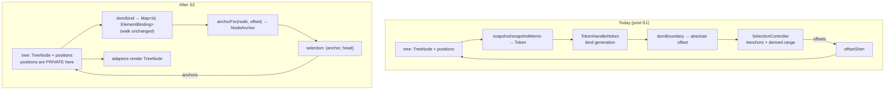

# S2 Core Addressing — Subsystem Design Spec

**Version:** 1.1 — **ACTUALIZED against what was built.**
**Status:** Implemented (S2.1–S2.9 landed)
**Date:** 2026-08-10; actualized 2026-08-11
**Parent:** S1 Tree Core (`docs/tree-core-decisions.md`; spec at
`git show 4d83cad4:docs/superpowers/plans/2026-08-08-markput-s1-tree-core-v2.md`).
**Supersedes:** `2026-08-10-markput-s2-selection-v1.md` and
`2026-08-10-s2-selection-2-1-2-2-plan.md` — both banner-marked superseded and
**deleted from the working tree at S2.9**; retrievable from history.
Conventions: `docs/conventions.md`.

### How to read v1.1

This was a DESIGN document, written before the work. Several of its decisions were
corrected during implementation, by measurement. Those corrections are folded in
**in place**, each marked `MEASURED CORRECTION` and stating what was measured — the
original claim is kept next to it, because a spec that quietly rewrites itself
teaches nothing. Everything not so marked shipped as written.

The corrections, in one list:

| § | Original claim | What shipped, and why |
|---|---|---|
| §1.3, D2 | — | The identity bridge is **D2**. The superseded draft numbered it D3 and that numbering leaked into the S2.1 task text; the code comment (`domBoundary.ts:53`) says `spec S2 D2` and is right. |
| D3 | `TransactionResult` grows `selectionBefore` **and** `selectionAfter` | `selectionBefore` was later **deleted as write-only** — nothing ever read it back off the result. `selectionAfter` and the numeric `map` are what survive. |
| D3 | — | `map` did keep its numeric signature exactly as designed, and `adopt` does resolve `selectionAfter` from **pre-mutation** offsets. Confirmed by falsification, not assumed (§11, S2.3). |
| D8 / §4.7 | "`roots` is the structural signal"; `renderTree` deleted outright | `renderTree` became **`renderEpoch`, a counter**. `roots` alone CANNOT drive the render: adoption writes it only when the root list changes **by reference**, so a mark's value change and a structural change inside a slot both leave it equal, `rendered()` never fires and `bind` never runs. Measured — dropping `renderEpoch` from either container left the whole suite green, which is why two "a mark value change announces changed" cases exist now. |
| §2.3, D6 | `replaceBetween(from, to, text): boolean` | Returns **`NodeAnchor \| undefined`** — the caret the edit's natural post-state wants, resolved against the POST-splice tree. Only the token layer may form the offset `min(from,to) + text.length` needs, so it answers with it rather than side-effecting; `EditController` applies it and `MarkputApi.replaceRange` reads it as a success flag. |
| §4.8 | the `useMarkput` sample passes `s => ({nodes: s.tokens.nodes})` and then `nodes.map(…)` | The sample is **wrong as written**: the selector's RETURN is the target, so a reactive entry must be the signal itself and the sample must not call it. See §4.8 for the shipped shape. |
| §5 | "no export of `@markput/core` accepts or returns an absolute document offset" | True of **`MarkputApi`**, and NOT literally of every export: `Store` is a value export, so `store.edit.setValue(text, caretOffset?)` and `store.tokens.anchorAt` / `offsetOf` are reachable through it. State it of `MarkputApi`. |
| §5 | `Anchors` is internal | `OverlayMatch.range` became an `Anchors` (S2.5), and that type is carried by both adapters, so **`Anchors` is public now** — a change §5 did not anticipate. |
| §5, D12 | `Token`, `TextToken`, `MarkToken` all leave the root export | `MarkToken` was **put back at S2.9**: `denote` is a published export whose callback parameter is one, so dropping it made a shipped signature unnameable. `Token`/`TextToken` stay internal. |
| §4.6 | the declaration-order hazard forces a layout exception for `selection` | **FALSIFIED at S2.9.** See §4.6. |

Behavior changes are collected in **§5.1** rather than scattered: S2 was specified
as behavior-preserving and six things moved anyway, each deliberately.

---

## 1. Overview

S1 inverted the core: the token tree became the source of truth and the value
string its projection. Three compat layers survived that inversion, and the code
labels all three as compat with an explicitly deferred lifetime:

| Leftover | Self-description | Stated lifetime |
|---|---|---|
| `tree/offsetShim.ts` | "The internal offset **shim** (spec D8)" | "until the block-rows follow-up (§9) gives them node-anchored verbs. Its lifetime is **that** follow-up's, NOT S1.7's" (`offsetShim.ts:4-10`) |
| `dom/TokenHandle.ts#token` | "the generation the DOM is currently **SHOWING** (spec D9)" | "the deferral of node-backing to the phase that gains a caller is plan decision D-b" (`TokenHandle.ts:30-42`) |
| `tree/snapshot*.ts` → `Token` | "Spec D9's **compat** snapshot memo" | none stated; alive because both adapters render `Token[]` |

S2 retires all three, in two cuts:

- **Cut B — one address space.** Above `tree/`, every position is a `NodeAnchor`
  or a `TreeNode`. Absolute offsets survive only *inside* `tree/` (the string
  projection and splice arithmetic) and at one documented whole-value verb.
- **Cut A — one node representation.** `TreeNode` is what adapters render. The
  `Token` snapshot reverts to being the parser's output type and the §7.1
  correctness oracle, nothing more.

The public API does not have to be invented for this. `MarkputApi` already speaks
anchors — `insertMark(at: NodeAnchor | 'caret')`, `replaceRange(from, to, text)`,
`select(anchor, head)`, `selection(): {anchor, head}`. S1 shipped that surface and
lowered every member onto an offset internally. S2 removes the lowering.

### 1.1 Goals

- **G1** — Delete the offset shim (S1 D8) and every absolute-offset read above
  `tree/`. `boundaryFor`, `placeCaret(n)`, `selectRange(n, n)`, `RawSelection`
  and `lowerReplace` do not exist afterwards.
- **G2** — Delete the bind generation (S1 D9). No handle carries a token;
  `dom/` answers questions of **identity**, never of **coordinates**, so the
  adopt→bind window stops being a coordinate-space hazard.
- **G3** — Delete the compat snapshot. One node structure travels from adoption
  to the rendered element.
- **G4** — Selection has one owner inside the token layer and the
  `tokens ↔ selection` construction cycle is gone. (Carried verbatim from the
  superseded draft's G1/G3/G4.)
- **G5** — One vocabulary on the public surface: `TreeNode` + `NodeAnchor`.
  `Token`, `TokenHandle` and `SelectionSnapshot` leave it.

### 1.2 Non-Goals

- **Not** declared DOM identity (a per-token `ref`, so `element ↔ node` is a map
  rather than a walk). `dom/bind.ts`'s positional walk stays exactly as it is.
  Deferred by maintainer decision; recorded in §9 as the next worthwhile change.
- **Not** first-class block rows. S1 §1.2 named that a non-goal and it stays one:
  `block/` keeps synthesizing a whole new value string, through **one** verb that
  is the sole surviving offset entry point (D6).
- **Not** composition/IME, undo, collaborative editing, or selection *direction*
  preservation across repair (an S1-inherited gap named in the merge review).
- **Not** parser changes. `Token` stays as `Parser#parse`'s output and as the
  §7.1 output-equivalence oracle the tree specs assert through (`stripIds`).
- **Not** deleting `anchorAt` / `offsetOfAnchor`. They lose every caller outside
  `tree/` and survive as adoption's internals (D1).
- **Not** moving text-surface writes to the framework renderer. Core already owns
  them and keeps owning them (D7).

### 1.3 Relationship to the superseded S2 Selection draft

| Draft element | Disposition here |
|---|---|
| G1 cycle, G3 one owner, G4 wiring | **Carried** — S2.9 |
| G2 boundary → anchor | **Generalized** — the draft applied it to `sync` alone; D2 applies it to every DOM read |
| D1 tree-half / DOM-half split | **Carried** — D10 |
| D2 "one walk, two projections" | **Void** — there is no second projection to keep in agreement |
| D3 bridge by stable id | **Carried** — D2. MEASURED CORRECTION: the draft's number leaked into the S2.1 task text as "spec D2/D3"; the shipped comment (`domBoundary.ts:53`) cites `spec S2 D2`, which is the right one. |
| D4 narrow fail-closed | **Carried** — D4 |
| D5 `remap` stays in `onResult` | **Carried** — D3 |
| D6 `readRaw` survives numeric | **Amended** — the *finding* (DOM truth ≠ model truth, gated by `input.spec`) is kept; the numeric *form* is not. Becomes `domAnchors()` (D5) |
| D7 `#generation` survives | **Void** — it exists solely to invalidate the derived numeric `range`, which is deleted (D11) |
| D8 `dom*` authority prefix | **Carried** — D5 |
| D9 `SelectionSnapshot.raw` survives | **Void** — its only production consumer is `readRaw` |
| D10 snapshot gains a live `Range` | **Carried** — D2 |
| Phases S2.1–S2.4 | **Replaced** by S2.1 + S2.4 here (one projection, not two) |
| Phases S2.5–S2.7 | **Carried** — S2.9 here |

---

## 2. Architecture

### 2.1 Component Diagram



The two arrows out of `A4` and into `A1` are the whole of Cut B: nothing between
the DOM and the tree is ever a number.

### 2.2 Key Design Decisions

**D1 — Offsets stop at the `tree/` boundary; they are not deleted.**
`position` fields, `joinNodes`, `transactions`' splice arithmetic and
`valueBoundary`'s windows all keep working in absolute coordinates — that *is*
the string projection, and S1 D3 makes positions parser-stamped plain fields for
exactly this. What changes is that no module above `tree/` reads them.
`anchorAt` / `offsetOfAnchor` therefore survive as adoption's internals
(`resolveMappedAnchor`, `selectAll`, `isAllSelected`) and lose their external
callers.
_Tradeoff:_ "no offsets" is a statement about a boundary, not about the codebase,
so the invariant has to be enforced by review rather than by the type system. The
cheap enforcement is that `tree/`'s exports simply stop returning numbers —
§5's export table is the checkable form.

**D2 — One walk, one projection: `anchorFor` replaces `boundaryFor`.**
`rawPositionFromBoundary`'s 14 numeric returns have exactly three shapes
(`token.position.start`, `token.position.end`, `token.position.start + local`,
plus the empty-document literal `0` at `domBoundary.ts:84`). Each maps to an
anchor directly:

```
document-start        → 'start'
<token>.position.start → {before: node}       node = find(handle.id)
<token>.position.end   → {after: node}
start + local          → {node, offset: local} when node.kind === 'text'
```

`handle.id` is a `readonly` field on `TokenHandle` (`TokenHandle.ts:67`) and is
generation-independent, so the bridge never touches a bind-generation token. The
superseded draft needed a `BoundaryTarget` intermediate to feed two projections;
with one projection the walk emits anchors directly and the intermediate is not
built.
_Tradeoff:_ the pinned numeric probe grids (`TokenModel.spec.ts:317`,
`TokenModel.facade.spec.ts:196`) cannot survive byte-identical — they assert
numbers. They convert to anchor assertions, which is a genuine loss of a
regression-detecting oracle. Mitigated by S2.1's equivalence property
(§7.2), which pins `offsetOfAnchor(anchorFor(p)) === boundaryFor(p)` for every
probe in those grids *while both exist*, then retires with `boundaryFor`.

_Tradeoff 2 — a temporary second walk, and it is deliberate._ Between S2.1 and
S2.6 the two walks coexist and must be kept in agreement, which is exactly the
"near-duplicate fork" AGENTS.md warns about. The superseded S2 Selection draft
avoided it by extracting a shared `BoundaryTarget` intermediate feeding two
projections. That shape is right **only if both projections are permanent**.
Here the numeric one is deleted at S2.6, so the intermediate would be scaffolding
built to be torn down, threaded through five phases — more churn than the fork.
The fork is bounded instead: it lives for five phases, and §7.2's equivalence
property holds the two walks in agreement for every probe in both pinned grids
for the whole of that life. A reviewer reaching for the duplication objection
should confirm that property still exists before raising it.

**D3 — the selection channel becomes anchor-shaped; `map` does not change at
all.**
The obvious move — `map(anchor) → NodeAnchor` — is **wrong, and measurably so**.
`map` is called lazily by the consumer, i.e. *after* `adopt` has rewritten node
`position` fields in place (`adopt.ts:140`'s batch). An anchor handed to it then
would be converted with `offsetOfAnchor` against **post**-adoption positions and
shifted a second time: exactly the double-shift S1 documents at
`TransactionResult.selectionBefore` and at `anchors.ts:29-34`. The offset must be
formed before the mutation, and only `adopt` is on that side of the line.

So the mapping moves into `adopt`, which is the only place that can do it
correctly:

```ts
selectionBefore: Anchors | undefined   // the capture, now anchors  ← LATER DELETED
selectionAfter:  Anchors | undefined   // resolved by adopt, pre-mutation offsets
map(offset: number): NodeAnchor        // UNCHANGED — tree-internal, property-gated
```

> **MEASURED CORRECTION — `selectionBefore` did not survive.** It was added as
> designed and then deleted as **write-only**: `adopt` needs the capture as an
> ARGUMENT (it forms the two pre-mutation offsets from it), but nothing ever read
> it back off the `TransactionResult`. `repair` applies `selectionAfter` and
> nothing else. The two halves of the decision that DID ship are the ones that
> mattered: `map` kept its numeric signature, and `adopt` resolves `selectionAfter`
> from pre-mutation offsets — falsified rather than assumed, see §11's S2.3 entry.

`adopt` reads the two offsets between `const prev = tree.roots()` (`:47`) and the
mutating `batch` (`:140`), then resolves them through its existing `map` after
the walks. `remap` becomes `select(result.selectionAfter.anchor, …head)` — an
application, not a computation, so the ordering hazard is unrepresentable at the
call site.

`map` keeping its numeric signature is not a D1 violation: `TransactionResult` is
a `tree/` type and offsets are legal there. After S2.4 its only caller is `adopt`
itself; its six spec call sites (`adopt.spec.ts` ×5, `adopt.property.spec.ts` ×1)
keep working unchanged, which is the point — they are the property gates on the
mapping semantics (right affinity, no affinity parameter, S1 plan decision D-a).
_Tradeoff:_ `TransactionResult` grows a field rather than changing one, and the
result now carries a value only one consumer reads. Accepted: the alternative
costs six gates and re-introduces a bug S1 already paid for.

**D4 — Fail-closed is narrow, and gated on real failures only.**
`anchorFor` answers `undefined` in exactly two cases beyond the ones it inherits:
the handle's id is absent from the live tree, or a text-local offset exceeds the
live node's text length. It is **not** gated on the adopt→bind window. In that
window the DOM is one generation stale, but a text-local offset is relative to
the node's own text: if the edit landed elsewhere the offset is exactly right —
and right in a way the numeric path is not, since that one adds a stale
`position.start`. This is why G2 says the window stops being a coordinate hazard.
_Tradeoff:_ a click inside a node whose text shrank in the same window is dropped
rather than clamped. A clamped anchor is indistinguishable downstream from a
deliberate one; `undefined` leaves the previous anchors standing and the next
`selectionchange` corrects it. (Carried from the superseded draft's D4.)

**D5 — The DOM-truth read survives, in anchor form, named `domAnchors()`.**
The superseded draft's D6 proved `readRaw` is not a duplicate of the stored
selection, and that proof stands: `input.ts:35-45` documents and gates the case
where the stored selection says all-selected while the live DOM selection is
gone, so the read answers `undefined` and `handleDeleteKey` deliberately falls
through **without** `preventDefault`. Its gate is `input.spec`'s "clears the
whole value even when the DOM selection is gone", and four of its five call sites
are `keydown`/`beforeinput` handlers where the DOM is the freshest authority
(`arrowNav.ts:25-28` says so in place). S2 keeps the semantics and changes the
type: `domAnchors(): {anchor, head} | undefined`.
The `dom*` prefix is the authority marker: `domAnchors()` / `domSelection()` mean
"what the DOM says right now"; `selection.anchors()` means "what the model
believes". This also retires the TS2300 collision documented twice
(`TokenModel.ts:370-375`, `MarkputApi.ts:33-39`).
_Tradeoff:_ two selection reads coexist. Mitigated by the prefix and by their
different homes.

**D6 — Exactly one verb keeps offsets, it is internal, and it is the whole-value
one.**
`block/operations.ts` is a whole-value *rewriter*, not an offset *addresser*: it
synthesizes a complete new string from row positions and hands it over
(`blockEdit.ts:87,135,281`). Converting it to anchors would be a re-model of
block rows, which S1 §1.2 excludes. Three verbs, split by who owns what:

```ts
TokenModel.setValue(text): boolean                     // the tree-level write
EditController.setValue(text, caretOffset?): void      // ← THE surviving offset
MarkputApi.setValue(text): boolean                     // public, unchanged
```

`caretOffset` indexes **the string the caller just supplied** — computed before
that string is parsed, so no node exists to name. It is not reachable from the
public export, so §5's invariant holds without an exception.
`block/` therefore keeps reading `position` on the rows it slices, and AC-1.5's
grep allowlists it alongside `tree/` and `parser/`.
_Tradeoff:_ one numeric API remains, and it is the ugly one. Accepted as the
honest scope boundary; §9 records that first-class rows retire it. `block/`'s 404
source lines are untouched by Cut B; Cut A type-swaps them (S2.8).

**D7 — Text-surface content stays core-written; Cut A does not move it.**
`resolveSlot.ts:63-65` renders a text token as an empty `<span>` (or the global
`Span` slot with a `value` prop); the character data is written by core
(`bind.applyMountState`, `commit.commitText`). Cut A therefore does not have to
answer "who writes into contenteditable" — it replaces the *mechanism* (a
commit-time text branch keyed by `CommitChange`) with a per-bound-node effect
`el.textContent = node.text()`, conditional on inequality exactly as today.
_Tradeoff:_ one effect per bound text node instead of one batched loop per
commit. No benchmark is offered and none is claimed; per AGENTS.md a performance
claim would need one. What is claimed is deletion: `commitText`, `CommitChange`,
`CommitInput.changes` and the escalation path go with it.

**D8 — Per-node subscription replaces snapshot identity as the render gate.**
Today `renderTree` changes reference on structural commits, and
`Token.tsx`'s `memo` runs `sameToken`, an O(subtree) value compare, to suppress
re-renders caused by shifted positions ("101 Mark renders on a head insert at 100
marks, 1 with this" — `Token.tsx:13-19`). Under A, `roots` is the structural
signal and each component subscribes to its own node's `value`/`meta`/`children`
signals. A mark whose value changed re-renders alone; a position shift notifies
nobody, because S1 D3 already makes `position` a non-reactive plain field.
_Tradeoff:_ this replaces a measured optimization with an unmeasured one, and it
is the riskiest thing in this spec. S2.8's gate is therefore a render-count
assertion, not just a green suite — the existing measurement is the baseline to
match or beat.

**D9 — `TokenHandle` becomes a pure DOM binding.**
Its five bind-generation readers all disappear upstream: `domBoundary`'s
type/position/content reads (D2), `commit.ts`'s divergence detector (D7 — the
per-node effect *is* the reconciliation, so there is no separate write to
verify), `setEditable`'s type read (→ `node.kind`), and `arrowNav.ts`'s position
read (→ anchor comparison). `#token`, `refresh()` and `token()` go; the handle
keeps `id`, the element bindings, and the caret commands.
_Tradeoff:_ deleting `assertAligned` removes a live invariant check that has
caught real bugs (the a558bf44 body records "a sweep found 12 divergences, some
two generations behind"). Replaced, not dropped: S2.7 adds a dev-only assertion
inside the per-node text effect, which is the same claim at the same place.

**D10 — Selection splits tree-half / DOM-half, inside the token layer.**
`tree/selection.ts` holds the anchors and `remap` and is DOM-free;
`dom/SelectionDriver.ts` holds listeners, caret application, the mouse-sweep flag
and the editable policy. The split is not cosmetic: today all 673 lines of
`SelectionController.spec.ts` need a mounted store.
_Tradeoff:_ "selection" is two files and the driver needs delegating reads.
(Carried from the superseded draft's D1.)

**D11 — `#generation` and the derived numeric `range` are deleted together.**
`#generation` exists only because `range` derives absolute offsets from anchors
whose `position` fields adoption mutates without notifying. With no derived
numeric range there is nothing to invalidate. The one consumer that genuinely
wants numbers, `isAllSelected`, is a computed *inside* `tree/selection.ts` and may
read positions there (D1).
_Tradeoff:_ `MarkputApi.selectionRange(): Range` is deleted rather than
reimplemented. It is the only public break Cut B makes.

**D12 — `Token` leaves the public API and stays the parser's type.**
Root exports lose `Token`, `TextToken`, `MarkToken`. They have exactly two
production readers outside core (`Container.tsx`, `Container.vue`, both off
`renderTree`); the other ~13 adapter files only *type* on them
(`packages/core/index.ts` records this). `toMarkInfo(token, depth)` becomes
node-shaped, and `useMark()` — today `store.tokens.markFor(token)`, a conversion
from snapshot back to node — becomes a direct context read.
_Tradeoff:_ a breaking adapter change, unavoidable and the point of Cut A.
`@markput/core` is unpublished, so it reaches no external consumer.

### 2.3 Surface after S2

```ts
// TokenModel — engine SPI (AS SHIPPED)
readonly selection: Selection                 // tree half, public sub-model
anchorFor(node: Node, offset: number, affinity?: 'before' | 'after'): NodeAnchor | undefined
domAnchors(): Anchors | undefined             // was SelectionController.readRaw
domSelection(): SelectionSnapshot | undefined // was selection(); `raw` REMOVED, `range` ADDED
focusFirst(): void
placeAtHandle(handle, boundary?): boolean     // survived; see §11's deletion-checklist note
isUserSelecting: Signal<boolean>              // survived; test-only consumers
renderEpoch: Computed<number>                 // was renderTree — a COUNTER, see §4.7
nodes: Computed<readonly TreeNode[]>          // unchanged; also THE render read
find(id): TreeNode | undefined                // unchanged
changed: Event<TokenDelta>                    // unchanged
replaceBetween(from, to, text): NodeAnchor | undefined  // ← NOT boolean; see below
setValue(text): boolean                       // was replace({0,-1}, …)
anchorAt(offset) · offsetOf(anchor)           // the tree layer's coordinate boundary
applyText · applyStructural · tx              // unchanged (already node-local)

// tree/selection.ts — createSelection(deps): Selection   ← a DEP BAG, not {tree}
anchors(): Anchors | undefined
caretAnchor(): NodeAnchor | undefined         // added at S2.5 for insertMark('caret')
isAllSelected: Computed<boolean>
select(anchor, head?): boolean
selectNode(node: TreeNode, boundary: 'start' | 'end'): boolean
selectAll(): void
clear(): boolean
repair(result: TransactionResult): void       // named `repair`, not `remap`

// MarkputApi — public
insertMark · replaceText · replaceRange · setValue · tx · focus
selection() · select() · caret() · nodes() · find() · changed · value() · container
// removed: selectionRange()
```

> **MEASURED CORRECTION — `replaceBetween` returns an anchor, not a boolean.** It
> answers the caret the edit's natural post-state wants — an anchor at the END of
> what was inserted, resolved against the POST-splice tree — or `undefined` when
> the write was refused. That is an ANSWER and not a side effect because only this
> layer may form the offset it needs (`min(from, to) + text.length`), and nothing
> above `tree/` may form a number at all (D1). `EditController.replace` applies it;
> `MarkputApi.replaceRange` reads it only as a success flag. In controlled mode the
> tree has not moved (D6), so the anchor describes the pre-edit tree and
> `EditController` discards it there.
>
> **`createSelection` takes a dep bag, not the tree.** That was phasing at S2.2
> (`Store` still built the selection and `TokenModel` kept `#tree` private) and it
> outlived the reason: it is what keeps the module unit-testable over a bare
> `createTokenTree`, and what lets `TokenModel` satisfy `anchorAt` with the SEEDING
> read instead of the bare tree walk. Substituting the bare walk fails two cases.

Deleted mechanisms are tracked as a named list in §11.

Throughout, `Anchors` means `{anchor: NodeAnchor; head: NodeAnchor}`.

---

## 3. User Stories

**US-1 — A DOM boundary resolves to an anchor, and nothing resolves to a number.**
- AC-1.1 `anchorFor` returns `{node, offset}` for a boundary inside a bound text
  surface, where `node` is the **live** `TextNode` from `find(handle.id)`.
- AC-1.2 Container, child-sequence, token-shell, mark-presentation and row
  boundaries return `{before: node}` / `{after: node}` matching the edge the
  numeric projection produced.
- AC-1.3 The empty document returns `'start'`.
- AC-1.4 `boundaryFor`, `rawPositionFromBoundary`, `textTargetAt`,
  `markBoundaryAt`, `RawSelection` and `lowerReplace` do not exist.
- AC-1.5 The only modules reading `.position` are `features/tokens/tree/`,
  `features/tokens/parser/`, and `features/block/` + `keyboard/blockEdit.ts`
  (D6's whole-value rewriter). Verified by grep in the S2.6 gate; that allowlist
  is the checkable form of D1 and any addition to it is a spec violation.

**US-2 — The recorded selection gaps are closed, not guarded.**
- AC-2.1 The numeric-equality guard (`SelectionController.ts:283-296`) is deleted
  and the 8 browser assertions across the react and vue focus specs still pass.
- AC-2.2 "THE ONE RECORDED GAP" (`:297-308`) is deleted with the code path it
  describes.
- AC-2.3 A selection deliberately placed on the far side of a shared boundary
  (`{before: mark}`, `{after: mark}`, an end-of-text anchor) survives a
  `selectionchange` round-trip unchanged.

**US-3 — The DOM-truth read keeps its contract in anchor form.**
- AC-3.1 `domAnchors()` answers `undefined` when there is no live DOM selection,
  including when the stored selection is non-empty. `input.spec`'s "clears the
  whole value even when the DOM selection is gone" passes **unmodified**.
- AC-3.2 All five call sites (`input.ts`, `inputRange.ts`, `arrowNav.ts`,
  `blockEdit.ts`, `ClipboardController.ts` ×2) are behaviorally unchanged.

**US-4 — Edits are addressed by node.**
- AC-4.1 `EditController.replace(from: NodeAnchor, to: NodeAnchor, text)` is the
  text write path; `Range` does not appear in its signature.
- AC-4.2 `EditController.setValue(text, caretOffset?)` is the only member of any
  core module that accepts an absolute offset, it is not reachable from the
  public export, and its doc comment says both.
- AC-4.3 `block/operations.ts` is unchanged by Cut B (S2.1–S2.6). Cut A
  type-swaps its `Token` reads to `TreeNode` (S2.8) with no change of logic.
- AC-4.4 Typing into a text token immediately before a mark and pressing
  Backspace still swallows the mark (the `rangeForDelete` adjacency path,
  re-expressed on nodes).

**US-5 — Selection state is unit-testable without a DOM.**
- AC-5.1 `tree/selection.spec.ts` exercises anchors equality, `selectNode`,
  `selectAll`, `isAllSelected` and `remap` with no mounted container.
- AC-5.2 `remap` gains a property in `tree/adopt.property.spec.ts`: for every
  generated adoption, a stored anchor maps to a live node or to a document edge —
  never to a dead node.

**US-6 — One node reaches the renderer.**
- AC-6.1 Both adapters render from `tokens.nodes()`; `renderTree`, `keyOf`,
  `handleOf` and `markFor` do not exist.
- AC-6.2 `snapshot.ts`, `snapshotMemo.ts`, `treeInput.ts` and `commitInput.ts` are
  deleted; `Token` is imported only by `parser/`, `adopt.ts` and their specs.
- AC-6.3 A mark whose `value` changes re-renders that mark's component and no
  other. A structural edit at the head of a 100-mark document re-renders no more
  components than the current `sameToken` memo does (the `Token.tsx:13-19`
  measurement is the baseline).
- AC-6.4 `useMark()` returns the node from context without a lookup.

**US-7 — The store builds without a cycle.**
- AC-7.1 `new TokenModel(props, host)` takes two arguments; `SelectionPort` does
  not exist.
- AC-7.2 `Store.ts` carries no TS7022 annotation comment and no thunk;
  `pnpm run typecheck` passes with the annotations removed.
- AC-7.3 `EditController`, `KeyboardController`, `OverlayController`,
  `ClipboardController` and `MarkputApi` each take one fewer parameter.

**US-8 — The public surface speaks one vocabulary.**
- AC-8.1 `packages/core/index.ts` exports no `Token`, `TextToken`, `MarkToken`,
  `TokenHandle` or `SelectionSnapshot`.
- AC-8.2 Both adapters' generated `dist/index.d.ts` contain no
  `SelectionController` and no `Token` region.

---

## 4. Detailed Design

### 4.1 `anchorFor` — the single DOM projection

Signature and cases, mirroring today's control flow exactly. `liveOf(view)` is
`find(view.handle.id)`; `text(n)` narrows to `n.kind === 'text'`.

| Input case | Today (`rawPositionFromBoundary`) | `anchorFor` |
|---|---|---|
| `node === container`, no tokens | `0` | `'start'` |
| `node === container`, `offset<=0` | `tokens[0].position.start` | `{before: first}` |
| `node === container`, `offset>=len` | `last.position.end` | `{after: last}` |
| `node === container`, interior | affinity ? `before.end` : `after.start` | `{after: before}` / `{before: after}` |
| not a token lookup | `undefined` | `undefined` |
| `node === childSequenceHost`, `<=0` / `>=n` | `token.position.start` / `.end` | `{before: n}` / `{after: n}` |
| `node === childSequenceHost`, interior | `fromTokenChildBoundary` | `childAnchor` (below) |
| inside `textElement` | `token.position.start + local` | `{node: text(n), offset: local}` |
| surrogate split | `undefined` | `undefined` |
| `node === tokenElement` | as childSequenceHost | as childSequenceHost |
| mark presentation descendant | `undefined` if editable ancestor, else affinity ? `start` : `end` | `undefined` / `{before: n}` / `{after: n}` |
| `node === rowElement` | `offset<=0 ? start : end` | `{before: n}` / `{after: n}` |
| fallthrough | `undefined` | `undefined` |

`childAnchor` (from `fromTokenChildBoundary`):

| Case | Today | Anchor |
|---|---|---|
| text token, empty/absent surface | `token.position.start` | `{before: n}` |
| both neighbours resolve | affinity ? `beforeToken.end` : `afterToken.start` | `{after: beforeNode}` / `{before: afterNode}` |
| fallback | affinity `'before'` ? `token.position.start` : `token.position.end` | `{before: n}` / `{after: n}` |

The fallback's **inverted affinity** (`'before' → start`) is preserved verbatim;
it is load-bearing for today's pinned table and is the one place the reading is
counter-intuitive.

Two shape notes:

- The `{node, offset}` case requires `n.kind === 'text'`. Every path that
  produced `start + local` came from a `textElement`, which `bind` sets only for
  text tokens (`bind.ts:158`), so the narrow cannot fail in practice; it answers
  `undefined` rather than throwing, per §6.
- `anchorFor` takes `find` as a dependency, so it is not a pure function of the
  DOM context alone. Accepted — that dependency *is* the live-tree bridge.

### 4.2 `tree/selection.ts`

A factory in the `tree/` idiom (`createTokenTree`, `createTransactions`,
`createBoundary`), taking a **dep bag rather than the tree**:

```ts
createSelection(deps: {
  offsetOf(anchor: NodeAnchor): number
  anchorAt(offset: number): NodeAnchor
  value(): string
  find(id: Id): TreeNode | undefined
}): Selection
```

The bag is load-bearing for phasing, not decoration. `createSelection` cannot
take `{tree: TokenTree}` at S2.2: `TokenModel` holds `#tree` privately and
`Store` — which still constructs the selection until S2.9 — has no way to reach
it. The same four closures are satisfied by `TokenModel`'s public reads at S2.2
and re-pointed at `#tree` directly at S2.9, with no change to this module. It
stays DOM-free and unit-testable either way, which is D10's actual requirement.

State: `#anchors`, with identity equality via `anchorEquals` (unchanged — the DOM
sync rebuilds anchors on every `selectionchange`, so without it a mouse sweep
re-enters placement every tick). **No `#generation`** (D11).

`isAllSelected` is the one computed that still forms numbers, and it forms them
inside `tree/`:

```ts
computed(() => {
  const a = this.#anchors()
  if (!a) return false
  const v = tree.value()
  return v.length > 0
    && offsetOfAnchor(tree.roots(), a.anchor) === 0
    && offsetOfAnchor(tree.roots(), a.head) === v.length
})
```

`selectNode(node, boundary)` replaces `placeAtHandle(handle, boundary)`. The only
DOM-dependent part of today's implementation is `handle.alive()`; that check moves
to the two callers (`arrowNav`, `blockEdit`), which already hold the handle.

`remap(result)` is today's `repair` minus the generation bump, and minus the
computation (D3):

```ts
remap(result) {
  const next = result.selectionAfter
  if (!next) return
  this.select(next.anchor, next.head)
}
```

### 4.3 The selection channel (D3)

```ts
// tree/types.ts
export type Anchors = {readonly anchor: NodeAnchor; readonly head: NodeAnchor}

selectionBefore: Anchors | undefined
selectionAfter:  Anchors | undefined
map(offset: number): NodeAnchor     // unchanged

// tree/adopt.ts
export function adopt(tree, window, parsed, selectionBefore?: Anchors): TransactionResult {
  return untracked(() => {
    const prev = tree.roots()                                    // :47
    // BEFORE the mutating batch (:140) — this is the whole of D3.
    const beforeOffsets = selectionBefore && {
      anchor: offsetOfAnchor(prev, selectionBefore.anchor),
      head:   offsetOfAnchor(prev, selectionBefore.head),
    }
    …
    batch(() => { /* walks rewrite node.position in place */ })  // :140
    const map = (offset: number) => untracked(() => resolveMappedAnchor(out, offset, window, delta))
    const selectionAfter = beforeOffsets && {
      anchor: map(beforeOffsets.anchor),
      head:   map(beforeOffsets.head),
    }
    return {…, selectionBefore, selectionAfter, map}
  })
}
```

`SelectionRange` (`tree/types.ts:100`) is deleted — it was declared for
`selectionBefore` alone.

The capture still happens in the boundary's `fold`, before the parse — S1
established this (execution log, commit `ebe2e08c`) and the reason is unchanged
by the shape: a controlled commit produces no result, so the repair input is the
range captured at the **echo's** `arrive`, an entry the dispatcher never sees.
What changes is only that `fold` reads `selection.anchors()` instead of
`selection.range()`.

### 4.4 `dom/SelectionDriver.ts`

Constructed by `TokenModel`, mounted through `host.onMounted`, receiving
pull-closures in the `DomModel` style. Owns `#isPlacingCaret`, `isUserSelecting`
(now private), `#applySelection`, `#placeAt`, `#applyEditablePolicy`,
`#focusEmptyEditorOnClick`, `#trackUserSelecting`, `#trackSelection`,
`focusFirst`, `domAnchors`. All lifted verbatim except `sync`:

```ts
const sync = (): void => {
  const r = domSelection()?.range           // globalThis.Range, added to the snapshot
  if (!r) { selection.clear(); return }
  const anchor = anchorFor(r.startContainer, r.startOffset, 'after')
  const head   = anchorFor(r.endContainer,   r.endOffset,   'before')
  if (!anchor || !head) return              // D4: leave the stored anchors standing
  selection.select(anchor, head)
}
```

The two exits differ deliberately and both are today's behavior: **no DOM
selection** clears (today's `#anchors(undefined)` when `raw` is absent), while an
**unresolvable boundary** leaves the anchors standing (D4). The three other
`#anchors(undefined)` writes — `focusin` with no target, `focusout` after the
microtask, `syncIfInEditor`'s outside-the-editor branch — become
`selection.clear()`.

The numeric-equality guard is gone because its premise is gone: it existed only
because `anchorAt(offsetOf(a)) !== a` at a shared boundary. With no `offsetOf` in
the path, the anchor the DOM produces *is* the anchor stored, and `anchorEquals`
dedupes on identity.

`domAnchors()` composes the same two calls and returns `{anchor, head}`
normalized, or `undefined` whenever `domSelection()` is `undefined` — AC-3.1's
contract, unchanged.

### 4.5 Offset-free consumers

| Site | Before | After |
|---|---|---|
| `input.ts:47` | `readRaw()` → `rangeForDelete(range)` → `edit.replace(range, '')` | `domAnchors()` → `expandForDelete(anchors, direction)` → `edit.replace(from, to, '')` |
| `input.ts:126` `adjacentMarkRange` | walks tokens comparing `position.start/end` to a number | walks `nodes()` comparing anchor adjacency; returns `{from: {before: mark}, to: {after: mark}}` |
| `inputRange.ts` | `boundaryFor` ×2 → `{start, end}` | `anchorFor` ×2 → `Anchors` |
| `arrowNav.ts:38-44` | `readRaw()` numbers vs `token.position` | `domAnchors()` anchors vs the handle's node identity |
| `arrowNav.ts:56` | `placeAtHandle(h, b)` | `h.alive() && selection.selectNode(find(h.id), b)` |
| `serializeRange.ts` | trims tokens by numeric range | trims `TreeNode`s by an anchor pair |
| `TriggerFinder.#rawRangeForMatch` | `boundaryFor(node, i+len)` → `{start, end}` | `anchorFor(node, i)` / `anchorFor(node, i+len)` → `Anchors` |
| `OverlayController.#probeTriggerFromCaretRange` | slices `value()` at `sel.start` | slices the caret node's own `text()` at the anchor offset |
| `blockEdit.ts:139-141` | `readRaw().range.start` → insert at that offset | insert at the caret anchor |
| `blockEdit.ts:87,135,281` | `edit.replace({0,-1}, v, pos)` | `edit.setValue(v, pos)` — D6, unchanged semantics |
| `EditController` | `replace(range, text, caretAt?)` | `replace(from, to, text)` + `setValue(text, caretOffset?)`; the controlled-mode `caretAt` exemption (S1 plan decision D-e) moves to `setValue` and keeps its Drag-spec gate |
| `MarkputApi.#offsetOf` / `#live` | anchor → number → `tokens.replace` | `#offsetOf` deleted; `#live` kept (it is an identity check, not a coordinate one); `replaceRange` → `tokens.replaceBetween` |

`OverlayMatch.range` is part of the overlay contract consumed by both adapters
(suggestion replacement). It becomes an anchor pair; the adapters pass it back
into a write verb without inspecting it, so this is a type change, not a logic
change — to be confirmed against the storybook suites in S2.5.

### 4.6 `TokenModel` wiring (Cut B complete)

```ts
constructor(private props: PropsModel, private host: Host) {
  host.onMounted(() => { /* the (value, parser, isBlock) watch, then host.rendered */ })
  // LAST, in the constructor BODY — see below.
  this.#selectionDriver = new SelectionDriver({selection: this.selection, host, changed: this.#pipeline.changed, …})
}

readonly selection = createSelection({offsetOf, anchorAt, value})  // consumer-reads region
readonly #selectionDriver: SelectionDriver                          // internals, assigned above

#boundary = createBoundary({
  …,
  selection: () => this.selection.anchors(),
  onResult: result => {
    this.#pipeline.apply(result)
    this.#committed(this.#tree.value())
    this.selection.repair(result)
  },
})
```

**Declaration-order hazard — FALSIFIED, and the layout exception was dropped.**
The design predicted a real trap: class field initializers run in declaration
order, `TokenModel`'s layout is *consumer reads → adapter SPI → engine SPI →
wiring → internals*, `#tree` sits in internals, so a `selection` declared above it
would read `undefined` with no type error — and therefore `selection` and the
driver had to be declared after `#tree`, with a pointer comment up top.

S2.9 tested it instead of obeying it, and the prediction was wrong about this
field. **The mechanism is real** — a probe field initializer reading `this.#tree`
from the consumer-reads region was measured to answer `undefined`, silently, with
no throw and no type error, so anything that reads `#tree` eagerly from up there
IS broken. But `createSelection` does not: it takes a **dep bag** whose three
entries are closures, evaluated at the first verb call, long after every
initializer has run. Measured with `selection` declared first in the class: 1335
passed, unchanged, and a mounted store answers `isAllSelected` correctly.
`selection` therefore lives in the consumer-reads region where it belongs, with no
exception and no pointer comment.

**The DRIVER has a real constraint, and it is a different one.**
`SelectionDriverDeps` takes `host` and `changed` as VALUES rather than thunks (it
subscribes in its own constructor), so a field initializer would read `this.host`
— a constructor parameter property, which `tsc` rejects outright with **TS2729**,
"Property 'host' is used before its initialization" — and `this.#pipeline`, which
answers `undefined` silently from any initializer above it. It is built in the
constructor BODY instead, last, which also preserves the `onMounted` registration
order `Store` produced while it built `tokens` before the selection.

**TS7022 is genuinely unreachable.** `Store.ts` now carries no explicit type
annotation on any field and `pnpm run typecheck` is green across all seven
projects — the cycle is gone, not merely re-annotated.

### 4.7 The commit pipeline after Cut A

```ts
// what remains of dom/commit.ts (AS SHIPPED)
apply(result: TransactionResult): void   // was CommitInput
  → if (result.render) { bump renderEpoch; latch; wait for paint }
  → else { nothing — node signals already notified }
onRendered(): void → bind(container, tree.roots()) ; drain delta ; changed(delta)
```

> **MEASURED CORRECTION — `roots` cannot be the render signal; `renderEpoch` is.**
> D8 and this section both said "`roots` is the structural signal" and `renderTree`
> is deleted outright. It is not deletable, only replaceable: adoption writes
> `roots` **only when the root list changes by reference** (`adopt.ts`'s `sameNodes`
> gate), so a mark whose value changed and a structural change INSIDE a slot both
> leave it equal. A container subscribed to `nodes` alone never re-renders for
> either, `rendered()` never fires, `bind` never runs and the paint latch never
> opens. `renderTree` therefore became **`renderEpoch`, a counter** carrying the
> same `render` bit with the payload dropped — same routing, same latch, no tree.
> The gap had ZERO coverage: dropping `renderEpoch` from either container left the
> whole suite green, which is why the two "a mark value change announces changed"
> cases exist in the render-count specs now.

- `CommitInput`, `CommitChange`, `commitText`, the text/structural routing bit
  and the escalation path are deleted. The routing question "does the renderer
  need to run?" is `result.render`, which `adopt` already computes
  (`adopt.ts:203`).
- `TokenDelta` is derived from `TransactionResult` directly at the announce site;
  `treeInput.ts`'s subtree-flattening of `added` moves there verbatim, because
  `foldDelta` still cancels by exact id.
- The text write becomes, per bound text node, at bind time:
  ```ts
  effect(() => { const t = node.text(); if (el.textContent !== t) el.textContent = t })
  ```
  disposed when the binding is replaced or the node dies. In dev
  (`import.meta.env?.DEV`), the same effect asserts alignment — D9's replacement
  for `assertAligned`.
- **One writer, not two.** `bind.applyMountState`'s `textContent` write is
  subsumed rather than kept alongside: `bind` *creates* the effect, and an
  effect's immediate first run performs exactly that initial reconciliation.
  `applyMountState` keeps only its `contentEditable`/`tabindex` half. Two writers
  racing on one surface is the failure mode S2.7's verification hunts for, so the
  design must not have two.
- `pendingStructural` survives as the paint latch (the DOM is genuinely one paint
  behind); what it no longer gates is `handle(id)`, because ids resolve against
  the live tree and D4 makes that correct.

### 4.8 Adapters after Cut A

```tsx
// Container.tsx — AS SHIPPED
const {nodes} = useMarkput(s => ({
  nodes: s.tokens.nodes,
  // SUBSCRIBED, not read. Without it the container never re-renders for a commit
  // that leaves the root list equal by reference — see §4.7's correction.
  renderEpoch: s.tokens.renderEpoch,
}))
nodes.map(n => <Token key={n.id} node={n} depth={0} />)

// Token.tsx — memo compare deleted; the component subscribes to its own node
const {value, meta, children} = useMarkput(() =>
  node.kind === 'mark'
    ? {value: node.value(), meta: node.meta(), children: node.children()}
    : {})
```

> **CORRECTION — the sample was INCOMPLETE, not malformed.** A reviewer hypothesis
> during actualization held that the object form is wrong because "the selector's
> return is the target, so it must return a thunk". CHECKED AND FALSE:
> `readSelected` (`shared/readSelected.ts`) branches on the target — a function is
> called, an OBJECT has each `isReactive` entry called for it — so
> `{nodes: s.tokens.nodes}` yields the array and `.map` is valid. Both shipped
> containers use exactly that object form. What the sample actually got wrong is
> the omission: with no `renderEpoch` entry the container under-notifies, which is
> the §4.7 correction and had zero test coverage until S2.8 added it.

`TokenContext` carries `{store, node, depth}`. `useMark()` returns
`useTokenContext().node` after a kind check. `useMarkInfo()` computes
`hasNestedMarks` from `node.children()`. Vue is the same shape with `effect`.

Affected: 7 React files, 8 Vue files (`Block`, `BlockMenu`, `Container`,
`DragHandle`, `DropIndicator`, `Token`, the token context/key, plus Vue's
`useMark`/`useMarkInfo`). Most are type swaps.

---

## 5. Output Contract

`@markput/core` is not published; the contract is `packages/core/index.ts` plus
the two adapters' surfaces.

| Export | Change |
|---|---|
| `MarkputApi.insertMark/replaceText/replaceRange/setValue/tx/focus/select/caret/selection/nodes/find/changed/value/container` | none — shapes and semantics identical |
| `MarkputApi.selectionRange()` | **removed** (D11) — the only public break Cut B makes |
| `NodeAnchor`, `TreeNode`, `TextNode`, `MarkNode`, `MarkPatch`, `Id` | none |
| `Token`, `TextToken` | **removed** from the root export (D12) |
| `MarkToken` | removed at S2.8, **RESTORED at S2.9** — `denote`'s callback parameter is one, and `denote` is re-exported by both published adapters, so dropping it left a shipped signature unnameable |
| `Anchors` | **ADDED to the root export** — unanticipated: `OverlayMatch.range` became an `Anchors` at S2.5 and both adapters carry the overlay contract |
| `TokenHandle`, `SelectionAnchor`, `SelectionSnapshot` | **removed** from `features/tokens/index.ts` |
| `toMarkInfo(token, depth)` | signature becomes `(node: MarkNode, depth)` |
| `SelectionController` | **removed** (appears in both adapters' `dist/index.d.ts` today) |
| `annotate`, `denote`, `Markup`, `cx`, `key`, overlay/block utilities, signals re-exports | none |

The invariant §5 exists to make checkable, and the ACCURATE form of it is:
**`MarkputApi` neither accepts nor returns an absolute document offset.**

> **MEASURED CORRECTION.** The spec stated it of every export — "no export of
> `@markput/core` accepts or returns an absolute document offset" — on the grounds
> that D6's `caretOffset` lives on `EditController`, which is not exported. That
> reasoning is incomplete: `Store` IS a value export (it is the only resolution
> path both adapters have), so `store.edit.setValue(text, caretOffset?)` is
> reachable through it, and so are `store.tokens.anchorAt(offset)` and
> `store.tokens.offsetOf(anchor)` — deliberately, since they are the tree layer's
> own coordinate boundary (D1) and the one place a number may be formed. The
> invariant that is both true and worth having is the one about `MarkputApi`, which
> is the public API proper; state it that way rather than claiming an exception-free
> rule the export list does not support.

### 5.1 Behavior changes, as built

S2 was specified as behavior-preserving. Six things moved anyway, each
deliberately, and each is recorded here because AGENTS.md forbids burying a
behavior change under "internal cleanup".

1. **`stepAnchor` fails closed on an unanchorable neighbour.** The numeric form
   stepped a character by arithmetic and always produced a position; the anchor
   form asks the tree for the neighbour and answers `undefined` when there is
   nothing anchorable there. A caller that cannot form the step now does nothing
   instead of acting on a guessed coordinate.
2. **`EditController.replace` normalizes a reversed pair.** `from` after `to` is
   legal and means the same span. The numeric predecessor took a `Range` that was
   normalized by its producer; with two independent anchors the verb owns it.
3. **Anchor-shaped `placeCaret` fails closed where the numeric one guessed.** The
   deleted numeric form searched every bound surface for a position and fell back
   to the nearest, reading bind-generation coordinates for a layout the adapter had
   not painted. The anchor form places through the anchor's OWN node or returns
   `false`.
4. **The pending-window fold is announcement-only.** Applies landing inside a
   latched structural window fold into that pass and announce ONE merged delta.
   Before the merge, two structural applies before a single bind dropped the first
   one's removals — so a consumer pruning off `removed` could miss a wave.
5. **Self-heal escalation is gone (S2.7).** `commitText` abandoned its branch on a
   missing handle or surface and re-bound the current DOM at once. There is no
   branch to abandon: `bind` arms one conditional-write effect per bound text
   surface, whose immediate first run IS both the mount-time reconciliation and the
   corruption heal. A misaligned node layer now recovers **at the next paint**
   instead of immediately. Pinned by "a text edit against an UNBOUND node layer
   announces and recovers at the next paint", which replaced the two cases that
   gated the old guards.
6. **A surviving text node's `Span` no longer re-renders when its text changes on a
   structural commit (S2.8).** Reasoned from the code, not from a failing test, so
   it is stated with its mechanism: pre-Cut-A, `Token`'s `sameToken` comparator
   included `a.content !== b.content`, so a re-materialized text token whose content
   had changed re-rendered and a user `Span` slot received a fresh
   `{value: token.content}`. Post-Cut-A, adoption keeps the node OBJECT and writes
   its `text` signal in place, `memo`'s reference compare therefore suppresses, and
   `Token.tsx` deliberately does NOT subscribe to `text()` (doing so would repaint
   the Span on every keystroke, which is the one thing the text path exists to
   avoid). The DOM text is correct either way — the per-surface effect writes it —
   but a `Span` slot that renders its `value` prop rather than its children now sees
   a stale one until something else re-renders it. This is the sharp edge of §9's
   pre-existing "`Span` slot vs core-written text" item, and it is worth a decision
   rather than a footnote.

---

## 6. Error Handling

Per S1 §6, unchanged: boolean / `undefined` returns; `throw` only on developer
error.

| Condition | Answer |
|---|---|
| `anchorFor`: handle id absent from the live tree | `undefined` |
| `anchorFor`: text-local offset > live node text length | `undefined` |
| `anchorFor`: resolved node is not a `TextNode` on the `{node, offset}` path | `undefined` |
| `anchorFor`: surrogate-pair split | `undefined` (inherited) |
| `anchorFor`: boundary outside container / inside a control | `undefined` (inherited) |
| `sync` receives `undefined` for either end | leave stored anchors unchanged (D4) |
| `domAnchors()`: no live window selection | `undefined` (contract, AC-3.1) |
| `selectNode` on a node not in the tree | `false` |
| `remap` with no `selectionBefore` | return |
| `setValue` with an out-of-range `caretOffset` | clamped by the existing caret path; no throw |
| `useMark()` outside a mark context | `throw` (unchanged — developer error) |

No new throw sites. Two are **removed**: `keyOf`'s id assertion and `bind`'s
id pre-pass throw, both of which exist because a `Token` may lack an id; a
`TreeNode` always has one.

---

## 7. Testing Strategy

Baseline to preserve: **1324 passed / 7 todo**. Where a case is deleted rather
than moved, §11's checklist names it and the reason.

### 7.1 Unit

- **`dom/domBoundary.spec.ts`** — rewritten onto `anchorFor`. Receives
  `describe('boundary mapping')` (6 cases) from `SelectionController.spec.ts`,
  which were `boundaryFor` tests that never belonged in the selection file. Adds
  US-1's five shapes plus the two fail-closed conditions.
- **`tree/selection.spec.ts`** (new, DOM-free) — receives the model-shaped cases
  from `SelectionController.spec.ts`: `position` (5), `isAllSelected` (4),
  `caret repair` (6), `controlled caret` (4), ~21 cases.
- **`dom/SelectionDriver.spec.ts`** (new, mounted) — receives the DOM-shaped
  cases: placement (3), `selectAll` (2), lifecycle (1), restoration via
  `tokens.changed` (5), `isUserSelecting → contentEditable` (1), empty-editor
  click (1). ~13 cases.
- **`seam/commitPipeline.spec.ts`** (S2.8) — `treePipeline.spec.ts` (810) and
  `treeInput.spec.ts` (191) merge and shrink: the pending-window
  bind-generation cases are deleted with the mechanism (D4/D9), the delta-fold
  and announce-ordering cases survive.
- **Deleted with their subject:** `tree/offsetShim.spec.ts` (123, S2.6),
  `tree/snapshotMemo.spec.ts` (174, S2.8).
- **Moved, not deleted:** `tree/snapshot.spec.ts` (125) follows `snapshot`/
  `stripIds` into `tree/__testing__/` — it is S1 §7.1's output-equivalence oracle
  and keeps that job (§7.2).

Redistribution must be a **move**, not a rewrite. Four comments in
`SelectionController.ts` name their own sole gate and are tracked individually:

| Comment | Names as its gate | New home |
|---|---|---|
| `:15-29` (`#anchors` equality) | "repeated selectAll applies to the DOM once" | `dom/SelectionDriver.spec.ts` |
| `:31-41` (`#generation`) | "keeps node and offset when the edit is outside the anchor…" | **retired with D11** — see below |
| `:102-111` (the `#anchors` watch) | 8 browser assertions, three focus specs | react/vue (unmoved) |
| `:177-186` (node disambiguator) | "places at a mark whose start equals the previous text node end…" + the same 8 | `dom/SelectionDriver.spec.ts` |

The `#generation` case is the one deliberate gate loss in this spec. It asserts
that a derived numeric range refreshes when adoption shifts positions under an
unchanged anchor. With no derived numeric range, the assertion has no subject.
It is replaced by AC-5.2's property (the anchor still resolves to a live node),
which is the surviving half of the same claim.

### 7.2 Property

- **S2.1 equivalence** — for every probe in `TokenModel.spec.ts:317`'s grid and
  `TokenModel.facade.spec.ts:196`'s pinned table:
  `offsetOfAnchor(roots, anchorFor(p)) === boundaryFor(p)`, including the
  `undefined` cases. This is S2.1's gate and the compensation for D2's tradeoff.
  It is deleted by S2.6 together with `boundaryFor`.
- **S2.3 ordering** — `map` is unchanged, so its existing property is the gate
  and needs no companion. What S2.3 adds instead is a falsification step (§11):
  moving the pre-mutation offset reads below `adopt.ts:140`'s batch must turn a
  named case red. A change that cannot be falsified this way has not been made.
- **`tree/adopt.property.spec.ts`** extension (AC-5.2): after every generated
  adoption, `remap`'s output anchors resolve to live nodes or document edges,
  never to a dead node.
- **S2.8 output equivalence** — S1 §7.1's property (`snapshot(tree)` deep-equals
  the parse) is preserved by keeping `snapshot`/`stripIds` as **test-only**
  helpers under `tree/__testing__/`, not by keeping the memo.

### 7.3 Integration / browser

- The 8 browser assertions across the react and vue focus specs are the
  acceptance gate for deleting the numeric guard (AC-2.1). They are the only gate
  that has ever caught this class of regression; the core suite stays green
  through it.
- `input.spec`'s "clears the whole value even when the DOM selection is gone"
  gates AC-3.1 and must pass **unmodified**.
- New browser case for AC-2.3: place a caret at `{before: mark}` where the mark's
  start equals the preceding text node's end, fire `selectionchange`, assert the
  stored anchor is unchanged.
- New render-count case for AC-6.3, in the storybook browser suites: a head
  insert at 100 marks, counting Mark component renders. The current number
  (`Token.tsx:13-19`: 1) is the baseline to match or beat.
- The block drag suites (`Drag.{react,vue}.spec`) gate D6's `setValue` caret
  semantics — "backspace on empty row › delete the row and reduce count by 1" is
  the case S1 records as the one that fails when the caret exemption is dropped.

### 7.4 Full gate

`pnpm test && pnpm run build && pnpm run typecheck && pnpm run lint:check && pnpm run format:check`

---

## 8. Performance Considerations

No performance claim is made and no benchmark is proposed, per AGENTS.md — with
one exception, which is why AC-6.3 exists.

- `anchorFor` allocates one small object per boundary resolution instead of
  returning a number. Resolution happens on `selectionchange`, `focusin` and per
  `beforeinput` — event rates, not loop rates.
- The anchor path is strictly *less* work than the numeric one for `sync`: it
  skips `offsetOf` on the write side and `anchorAt`'s tree walk on the read side,
  and the deleted guard also deletes a `range()` evaluation per
  `selectionchange`.
- **Cut A changes a measured behavior and therefore carries a measured gate.**
  Today's render suppression is `sameToken`, an O(subtree) value compare per mark
  (`Token.tsx:20-31`). Per-node subscription replaces it with signal identity.
  AC-6.3 pins the outcome; `parser.bench.ts` is unaffected either way.

---

## 9. Future Considerations

- **Declared DOM identity (the deferred "Cut C").** Give each token element a ref
  keyed by node id, so `element ↔ node` is a map instead of `bind.ts`'s
  positional walk. Deletes `walkDom`'s all-or-nothing frame alignment,
  `computeControlRoots`' per-commit ancestor sweep and the paint latch's last
  reason to exist. Independent of everything in this spec and the next worthwhile
  change after it.
- **First-class block rows**, which retire D6's `setValue` offset and let
  `block/operations.ts` address rows as nodes.
- **`map`'s short-circuit** (D3): skip the offset round trip when the adoption
  window does not overlap the anchor's node.
- **Selection direction across repair.** `direction` is computed today and not
  preserved by `remap` — an S1-inherited gap. S2 neither fixes nor worsens it;
  under D5 the field moves onto `domAnchors`' return or is dropped, to be decided
  when a consumer wants it.
- **Composition/IME.** Still descoped (S1 D10). `dom/SelectionDriver.ts` is where
  it would land.
- **`Span` slot vs core-written text.** `resolveSlot.ts:65` hands a user `Span`
  component `{value: token.content}` while core also writes `textContent` into
  the same element. Pre-existing; out of scope; recorded because D7 touches the
  neighbouring code.

---

## 10. Dependencies

### 10.1 Packages

None added. `@markput/core` stays dependency-free.

### 10.2 Internal contracts consumed

- S1 `NodeAnchor` / `TreeNode` / `TextNode` / `MarkNode` (`tree/types.ts`) —
  unchanged.
- S1 `adopt(tree, window, parsed) → TransactionResult` — `selectionBefore` and
  `map` change shape (D3); `structural`/`render`/`added`/`removed`/`updated`/
  `shifted` unchanged.
- S1 `CommitSink` and the controlled/uncontrolled commit policy — unchanged.
- `dom/textOffsets.ts` (`textOffsetWithin`, `textLength`,
  `hasEditableAncestorBefore`) — unchanged.
- `dom/bind.ts`'s walk — unchanged in behavior; re-typed from `Token` to
  `TreeNode` at S2.7.

---

## 11. Implementation Phases

No types phase: every type S2 needs already exists. The two shape changes
(`TransactionResult.map`/`selectionBefore`) are introduced by the phase that
produces them.

Cut B is S2.1–S2.6; Cut A is S2.7–S2.8; S2.9 is the shell.

### S2.1: `anchorFor` — the anchor projection, built alongside

**Scope:** Add `anchorFor(ctx, find, node, offset, affinity)` next to
`rawPositionFromBoundary`, covering every case in §4.1. **No consumer wired**;
`boundaryFor` untouched.
**Size estimate:** ~90 lines in `dom/domBoundary.ts`, ~180 spec lines.
**Contracts consumed:** None.
**Contracts exposed:** `anchorFor`.
**Gate:** `pnpm -w exec vitest run packages/core/src/features/tokens` — US-1
cases AC-1.1…AC-1.3 plus §7.2's equivalence property over both pinned grids.
**Verification:** Construct a store with a mark whose start equals the preceding
text node's end; confirm `anchorFor` distinguishes `{after: text}` from
`{before: mark}` where the numeric projection cannot. Confirm the inverted-affinity
fallback in `childAnchor` is preserved — it is the one counter-intuitive branch.
**Review tier:** full-review — G2's mechanism, and every later phase rests on its
equivalence.
**Dependencies:** None.

### S2.2: Pure move — `tree/selection.ts` + `dom/SelectionDriver.ts`

**Scope:** Relocate `SelectionController`'s body into the two new modules, split
tree-half / DOM-half (D10). **No behavior change**: `#generation`, the derived
numeric `range`, `placeAtHandle` and the four `#anchors(undefined)` writes move
**verbatim** — their retirement is S2.5's and S2.6's, so this diff stays a clean
move per AGENTS.md. Its 673 spec lines are redistributed in the same change (they
must be, to stay green): model-shaped cases to `tree/selection.spec.ts`,
DOM-shaped to `dom/SelectionDriver.spec.ts`, the 6 `boundary mapping` cases to
`dom/domBoundary.spec.ts` (§7.1).

`features/selection/` is **not** deleted here, and that is forced rather than
chosen: `createSelection` needs the tree, `TokenModel` holds `#tree` privately,
and `Store` — which still constructs the selection until S2.9 — cannot reach it.
So `SelectionController` survives as a ~25-line composition shell over the two
new modules, and the `SelectionPort` thunk still stands. S2.9 deletes the shell
when `TokenModel` takes ownership. §4.2's dep bag is what makes both wirings
satisfy one module.
**Size estimate:** 2 new source files (~90 + ~250), 3 spec files;
`features/selection/SelectionController.ts` shrinks 356 → ~25.
**Contracts consumed:** None.
**Contracts exposed:** `createSelection` (§4.2's dep bag), `Selection`,
`SelectionDriver`.
**Gate:** `pnpm test && pnpm run typecheck`. **Suite count unchanged** — a moved
case that disappears is a spec violation.
**Verification:** `git diff --stat` must read as a move: added lines in the new
files ≈ removed lines in the old, modulo import headers and the split. Confirm
each of the four self-named sole gates in §7.1 exists in its new home and still
fails when its mechanism is mutated.
**Review tier:** spot-check — mechanical, but the gate-preservation check is not.
**Dependencies:** None (parallel with S2.1).

### S2.3: The selection channel becomes anchor-shaped

**Scope:** Add `Anchors` to `tree/types.ts` and delete `SelectionRange`;
`selectionBefore: Anchors | undefined` plus a new `selectionAfter`, both resolved
inside `adopt` from **pre-mutation** offsets (D3, §4.3); `map(offset)` unchanged;
`createBoundary`'s capture reads `selection.anchors()`; `remap` applies
`selectionAfter`. Behavior-preserving by construction.
**Size estimate:** ~40 lines across `tree/types.ts`, `tree/adopt.ts`,
`tree/valueBoundary.ts`, `tree/selection.ts`.
**Contracts consumed:** S2.2 `Anchors` and its new home for `remap`.
**Contracts exposed:** the amended `TransactionResult`.
**Gate:** `pnpm test`. `adopt.spec.ts`'s five `map` cases and
`adopt.property.spec.ts`'s mapping property pass **unmodified** — `map` did not
change, which is the phase's own evidence that the semantics did not.
`valueBoundary.spec.ts`'s four `selectionBefore` assertions convert from
`{start, end}` to anchors.
**Verification:** Confirm by inspection that the offsets are read **above**
`adopt.ts:140`'s `batch` — the ordering is the entire correctness argument.
Falsify it: move the two `offsetOfAnchor` calls below the batch and confirm
`SelectionController.spec`'s "maps a caret inside the edited region to the end of
the inserted text" turns red. If it stays green, the hazard analysis in D3 is
wrong and must be rewritten. Then run the controlled-mode caret cases by hand —
type into a controlled input whose parent echoes.
**Review tier:** full-review — touches the S1 protocol every commit runs through.
**Dependencies:** S2.2.

### S2.4: `sync` onto `anchorFor`; `domAnchors`; the guard deleted

**Scope:** Add `range: globalThis.Range | undefined` to `SelectionSnapshot` and
remove `raw`. Rewrite `SelectionDriver`'s `sync` onto `anchorFor` (§4.4). Delete
the numeric-equality guard and both recorded-gap comments. `readRaw` →
`domAnchors()`; its five call sites convert. Behavior change.
**Size estimate:** ~−45/+25 in `dom/SelectionDriver.ts`, +3/−15 in `DomModel.ts`,
~30 lines across five consumers; 1 new browser case.
**Contracts consumed:** S2.1 `anchorFor`, S2.3's anchor-shaped result.
**Contracts exposed:** `domAnchors()`, `SelectionSnapshot.range`.
**Gate:** `pnpm test` (core + browser). AC-2.1's 8 browser assertions, AC-2.3's
new case, AC-3.1's named case unmodified.
**Verification:** Run the react and vue focus stories by hand — click into a
mark, tab between marks, sweep-select across a mark boundary. Focus must not be
dragged onto the neighbouring text node; that is the exact failure the deleted
guard prevented.
**Review tier:** full-review — behavior change whose only gate is the browser
suite.
**Dependencies:** S2.1, S2.3.

### S2.5: Offset-free write and read verbs

**Scope:** `TokenModel.replaceBetween` / `setValue`;
`EditController.replace(from, to, text)` + `setValue(text, caretOffset?)` (D6);
`placeAtHandle` → `selection.selectNode` + caller-side `alive()`; `input.ts`,
`inputRange.ts`, `arrowNav.ts`, `blockEdit.ts`'s caret-insert site,
`serializeRange.ts`, `TriggerFinder`, `OverlayController`, `MarkputApi` converted
per §4.5. `block/operations.ts` unchanged (D6).
**Size estimate:** ~12 files, net roughly flat (conversions, not deletions).
**Contracts consumed:** S2.1 `anchorFor`, S2.4 `domAnchors`.
**Contracts exposed:** the amended `TokenModel` write verbs, `EditController`,
`MarkputApi`, `OverlayMatch`.
**Gate:** `pnpm test && pnpm run typecheck`. AC-3.2's five sites, AC-4.4's
mark-swallow case, the storybook suggestion suites for `OverlayMatch.range`.
**Verification:** Type immediately before a mark and press Backspace (mark
swallow); trigger a suggestion and accept it (overlay range); copy a partial
selection spanning a mark and paste it back (serializeRange).
**Review tier:** full-review — the input hot path, and the widest blast radius in
the spec.
**Dependencies:** S2.4.

### S2.6: Delete the offset space — **Cut B complete**

**Scope:** Delete `tree/offsetShim.ts`, `TokenModel.replace`, `boundaryFor`,
`rawPositionFromBoundary`, `textTargetAt`, `markBoundaryAt`,
`DomModel.placeCaret(n)`/`selectRange(n,n)`, `RawSelection`, S2.1's equivalence
property, and — now that no numeric consumer is left — `#generation`, the derived
numeric `range` and `MarkputApi.selectionRange()` (D11). `DomModel` gains
`placeCaret(anchor)` / `selectRange(anchorA, anchorB)` lowered onto
`TokenHandle.placeCaret(local)`.
**Size estimate:** ~−400 lines across 8 files; `offsetShim.spec.ts` deleted.
**Contracts consumed:** S2.5.
**Contracts exposed:** the narrowed `DomModel` and `Selection`.
**Gate:** full gate, plus AC-1.5:
`grep -rn '\.position\.' packages/core/src packages/*/markput/src --include='*.ts*' | grep -vE '/(tree|parser|block)/|blockEdit\.ts'`
returns nothing.
**Verification:** Confirm `EditController.setValue`'s `caretOffset` is the only
offset parameter left outside the allowlist and that its doc comment states the
contract. Confirm §7.1's one deliberate gate loss (`#generation`'s case) is
replaced by AC-5.2's property and not merely deleted.
**Review tier:** full-review — this is where a missed consumer surfaces.
**Dependencies:** S2.5.

### S2.7: `bind` and `commit` on `TreeNode`; `TokenHandle` loses its token

**Scope:** Re-type `bind`'s walk from `Token` to `TreeNode` (same algorithm; the
`idFor` indirection and the id pre-pass throw go, since nodes always have ids).
Replace the text branch with per-bound-node text effects (§4.7, D7) and
`assertAligned` with the dev assertion inside them. Delete `TokenHandle#token`,
`refresh()`, `token()`; `setEditable` and `arrowNav` read `node.kind`.
**Size estimate:** ~−200 lines across `bind.ts`, `commit.ts`, `TokenHandle.ts`;
`TokenHandle.spec.ts` (302 + 179) shrinks.
**Contracts consumed:** S2.6 (no position reads left in `dom/`).
**Contracts exposed:** `bind(container, roots) → BindResult` (node-keyed).
**Gate:** `pnpm test`. `bind.spec.ts`'s 706 lines pass with node fixtures; the
divergence cases move to the effect's dev assertion.
**Verification:** Type continuously in a mark's slot while a sibling mark is
added — the two writers of a surface (effect and bind) must not fight; watch for
caret jumps.
**Review tier:** full-review — two DOM writers become one, and the failure mode
is silent divergence.
**Dependencies:** S2.6.

### S2.8: Delete the snapshot; adapters render nodes — **Cut A complete**

**Scope:** Delete `tree/snapshot.ts`, `tree/snapshotMemo.ts`, `seam/treeInput.ts`,
`seam/commitInput.ts`, `renderTree`, `keyOf`, `handleOf`, `markFor`. `roots` is
the render signal. Move `snapshot`/`stripIds` and their spec to
`tree/__testing__/`; merge `treePipeline.spec.ts` + `treeInput.spec.ts` into
`seam/commitPipeline.spec.ts` (§7.1). Convert both adapters (§4.8) — 15 files,
mostly type swaps — and delete `Token.tsx`'s `sameToken` memo. Type-swap
`block/`'s `Token` reads to `TreeNode` (AC-4.3): **not purely mechanical** —
`operations.ts` reads `token.slot.content` and builds a `Token` literal
(`EMPTY_TEXT_TOKEN`), and neither has a direct `TreeNode` equivalent
(`MarkNode.slot()` is a method, `slotRange` carries the offsets). Root exports
drop `Token`/`TextToken`/`MarkToken`; `toMarkInfo` becomes node-shaped.
**Size estimate:** ~−450 core lines, ~15 adapter files, ~4 `block/` files.
**Contracts consumed:** S2.7.
**Contracts exposed:** `nodes()` as the render read; the narrowed root export.
**Gate:** full gate + storybook browser suites. AC-6.1…AC-6.4, and AC-6.3's
render-count case against the `Token.tsx:13-19` baseline.
**Verification:** With React DevTools, edit a mark's value in a 100-mark document
and confirm one Mark component renders. Repeat for a head insert. Then confirm
`stripIds` still gates S1 §7.1 from its new home.
**Review tier:** full-review — the render model changes, and D8 names this the
riskiest decision in the spec.
**Dependencies:** S2.7.

### S2.9: Kill the cycle; specs and docs

**Scope:** `TokenModel` constructs `selection` and the driver (§4.6);
`SelectionPort`, the thunk and the TS7022 comment deleted;
`TokenModel.selection()` → `domSelection()`; `Store` and the five controllers
rewired; `KbCtx` drops `'selection'`; `features/selection/` deleted. Restore
`MarkToken` to the public export. Actualize the docs and this spec.
**Dependencies:** S2.8. **Review tier:** full-review.

**AS BUILT — the results, since this was the phase specified as "verify by
falsification":**

- **The declaration-order hazard is NOT real for `selection`.** See §4.6. The
  mechanism was probed and confirmed (an eager `this.#tree` read from the
  consumer-reads region answers `undefined`, silently), but `createSelection`'s dep
  bag never performs one. The layout exception was DROPPED, not kept "to be safe":
  `selection` is declared in the consumer-reads region, above `#tree`, and the
  suite is unchanged at 1335 passed. The DRIVER does have a constraint, a different
  one (TS2729 on a parameter property + an eager `#pipeline.changed`), so it is
  built in the constructor body.
- **TS7022 is unreachable.** `Store.ts` carries no annotation on any field;
  typecheck is green across all seven projects.
- **`SelectionController` is absent** from both adapters' regenerated
  `dist/index.d.ts` (0 occurrences in each).
- **Two deletion-checklist items did NOT happen, and should not have.** Item 6
  listed `placeAtHandle` and "the public `isUserSelecting` signal" for deletion.
  `placeAtHandle` has a production caller (`keyboard/blockEdit.ts`'s row focus,
  which needs a handle's own start/end and not a node anchor). `isUserSelecting`
  has no production caller outside the driver, but ten spec cases drive the
  editable policy through it; deleting it means rewriting them onto a synthesized
  mouse sweep, which is a testing change, not a cleanup. Both are delegated on
  `TokenModel` and recorded here rather than silently dropped.
- **Item 11's second half is not achievable either.** `TokenHandle` and
  `SelectionSnapshot` cannot leave `features/tokens/index.ts`: `keyboard/blockEdit.ts`
  types on the first and `TokenModel.domSelection()` returns the second, so removing
  the export makes a shipped return type unnameable.
- **`MarkToken` came back** — see §5.
- **Gate:** `pnpm test` 1335 passed | 7 todo (71 files), identical to the pre-phase
  baseline; build, typecheck, lint and format clean; `pnpm -F @markput/website run
  build` 47 pages.

### Phase Dependency Graph

```
S2.1 (anchorFor, alongside)   S2.2 (PURE MOVE: selection → tree/ + dom/)
 |                             |
 |                             --- S2.3 (map/selectionBefore → anchors)
 |                                  |
 -----------------------------------+
                                    |
                               S2.4 (sync → anchorFor · guard deleted)
                                    |
                               S2.5 (offset-free verbs)
                                    |
                               S2.6 (delete the offset space)  ← CUT B COMPLETE
                                    |
                               S2.7 (bind/commit on TreeNode)
                                    |
                               S2.8 (delete the snapshot)      ← CUT A COMPLETE
                                    |
                               S2.9 (cycle · docs)
```

Parallelizable: **S2.1 and S2.2** only — S2.1 adds a function with no consumer,
S2.2 moves files without touching boundary code. Everything after S2.4 is a chain
by construction: each phase's gate is "the previous mechanism has no callers
left", which cannot be checked out of order.

Cut B (S2.1–S2.6) is independently shippable and independently revertible. If
Cut A is abandoned after it, the result is still a strictly simpler core with one
address space; nothing in S2.1–S2.6 is scaffolding for S2.7–S2.8.

### Deletion Checklist (named mechanisms)

Tracked as mechanisms, not lines. Each must be gone by S2.9:

1. `tree/offsetShim.ts` + `TokenModel.replace` + the `end < 0` sentinel outside
   `setValue` (S1 D8 retired).
2. `boundaryFor` / `rawPositionFromBoundary` / `fromContainerBoundary` /
   `fromTokenChildBoundary` / `textTargetAt` / `markBoundaryAt`.
3. `RawSelection`, `readRaw`, `SelectionSnapshot.raw`, `#rawSelectionFrom`.
4. The numeric-equality guard (`SelectionController.ts:283-296`) and "THE ONE
   RECORDED GAP" (`:297-308`).
5. `#generation` and the derived numeric `range`; `MarkputApi.selectionRange()`.
6. `features/selection/` (the S2.2 composition shell, the directory, the barrel,
   and the `SelectionController` region in both adapters' `dist/index.d.ts`);
   `placeAtHandle`; the public `isUserSelecting` signal.
7. `SelectionPort` + the `() => this.selection` thunk + the TS7022 annotation
   comment; the `selection` parameter on five controllers; `'selection'` from
   `KbCtx`.
8. `TokenHandle#token` / `refresh()` / `token()` (S1 D9's read latch retired);
   `assertAligned` as a separate pass.
9. `tree/snapshot.ts` + `tree/snapshotMemo.ts` in production (test-only survivors
   move to `tree/__testing__/`); `seam/treeInput.ts`; `seam/commitInput.ts`;
   `CommitChange` / `CommitInput` / `commitText`.
10. `renderTree`, `keyOf`, `handleOf`, `markFor`, `Token.tsx`'s `sameToken`.
11. `Token` / `TextToken` / `MarkToken` from the root export; `TokenHandle` and
    `SelectionSnapshot` from `features/tokens/index.ts`.

---

## 12. Acceptance Summary

1. `anchorFor` covers every boundary shape the numeric projection covered and
   returns live-node anchors (AC-1.1…AC-1.3); its two fail-closed conditions are
   the only additions (§6).
2. No module outside `features/tokens/tree/` reads `.position` except `block/`
   (AC-1.5's allowlist), and **`MarkputApi`** takes and returns no absolute offset
   (AC-1.4, §5 as corrected — the original wording claimed this of every export and
   `Store` is a value export, so it was never literally true).
3. The numeric-equality guard is deleted and the 8 browser assertions pass
   (AC-2.1); the bind-generation round-trip is deleted, not guarded (AC-2.2); a
   far-side-of-boundary anchor survives a `selectionchange` round-trip (AC-2.3).
4. `domAnchors()` keeps `readRaw`'s `undefined` contract and `input.spec`'s named
   case passes unmodified (AC-3.1); its five call sites are behaviorally
   unchanged (AC-3.2).
5. `EditController.replace` speaks anchors (AC-4.1); `block/operations.ts` is
   untouched (AC-4.3); the mark-swallow path still works (AC-4.4).
6. `tree/selection.spec.ts` runs without a mounted container (AC-5.1) and `remap`
   has a property gate (AC-5.2).
7. Both adapters render `TreeNode`; `snapshot`/`snapshotMemo`/`treeInput`/
   `commitInput` are gone; `Token` is imported only by `parser/`, `adopt.ts` and
   specs (AC-6.1, AC-6.2).
8. A mark value change re-renders one component, and the 100-mark head-insert
   render count matches or beats the current baseline (AC-6.3).
9. **MET.** `new TokenModel(props, host)` takes two arguments and `Store.ts`
   typechecks with every annotation removed (AC-7.1, AC-7.2); five controllers each
   lose a parameter (AC-7.3).
10. **MET, with one amendment.** The root export carries no `Token`, `TextToken`,
    `TokenHandle` or `SelectionSnapshot`, and neither adapter's `dist/index.d.ts`
    carries `SelectionController` (AC-8.1, AC-8.2). `MarkToken` IS exported —
    restored at S2.9 because `denote`'s callback parameter is one (§5).
11. **Nine of eleven.** Items 6 and 11 are partial and the S2.9 entry in §11 says
    exactly which parts and why (`placeAtHandle` has a production caller;
    `isUserSelecting`, `TokenHandle` and `SelectionSnapshot` each still have a
    consumer that a deletion would break).
12. **MET, and the answer was NO.** The §4.6 declaration-order hazard was verified
    by falsification and turned out not to apply; the layout exception was dropped
    rather than kept. §4.6 records the probe.
13. **MET.** `pnpm test` 1335 passed | 7 todo across 71 files at S2.9, identical to
    the S2.8 baseline. (The spec's "1324" predated the render-count cases S2.7/S2.8
    added.)
